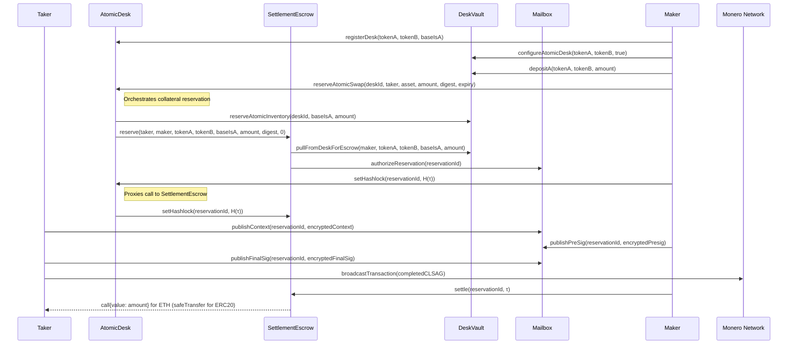
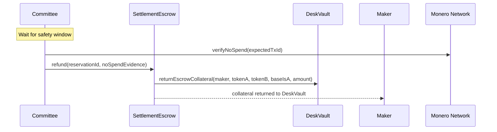

# EqualX Atomic Desks Design Document

**Version:** 1.0

## 1. Overview

Atomic Desks enable trustless cross-chain atomic swaps between EVM-based assets (ETH, ERC-20 tokens) and Monero (XMR). The system uses CLSAG adaptor signatures to cryptographically bind transactions on both chains, ensuring atomicity without requiring trusted intermediaries.

### 1.1 Design Goals

- **Atomicity**: Either both legs of the swap complete, or neither does
- **Privacy**: Monero transaction details remain private through ring signatures
- **Trustlessness**: No trusted third parties required for successful swaps
- **Collateralization**: All EVM-side assets are fully collateralized in DeskVault
- **Settlement Authority**: Only authorized parties (desk makers or committee) can settle swaps

### 1.2 Key Components

1. **AtomicDesk**: Main entry point for creating and managing atomic swap reservations
2. **SettlementEscrow**: Holds collateral and manages settlement/refund logic
3. **DeskVault**: Underlying inventory management and collateral source
4. **Mailbox**: Encrypted communication channel for adaptor signature exchange
5. **CLSAG Adaptor**: Cryptographic protocol binding EVM and Monero transactions

---

## 2. Architecture

### 2.1 System Components

```
┌─────────────────┐    ┌──────────────────┐    ┌─────────────────┐
│   AtomicDesk    │────│ SettlementEscrow │────│   DeskVault     │
│   (Entry Point) │    │  (Collateral)    │    │  (Inventory)    │
└─────────────────┘    └──────────────────┘    └─────────────────┘
         │                       │                       │
         │              ┌─────────────────┐              │
         └──────────────│     Mailbox     │──────────────┘
                        │  (Encrypted     │
                        │ Communication)  │
                        └─────────────────┘
                                 │
                        ┌─────────────────┐
                        │ CLSAG Adaptor   │
                        │   Protocol      │
                        └─────────────────┘
```

### 2.2 Data Flow

1. **Reservation**: Maker creates atomic swap reservation, collateral moves to escrow
2. **Context Exchange**: Taker sends encrypted Monero context via mailbox
3. **Presignature**: Maker responds with encrypted CLSAG adaptor presignature
4. **Completion**: Taker completes signature and broadcasts Monero transaction
5. **Settlement**: Authorized party settles EVM side using revealed adaptor secret

---

## 3. Core Contracts

### 3.1 AtomicDesk Contract

The AtomicDesk contract serves as the primary interface for atomic swap operations.

#### Key Functions

```solidity
function registerDesk(address tokenA, address tokenB, bool baseIsA) 
    external returns (bytes32 deskId)
```
- Registers a new atomic desk for a token pair
- Requires the desk to be enabled in DeskVault
- Returns unique desk identifier

```solidity
function reserveAtomicSwap(
    bytes32 deskId,
    address taker,
    address asset,
    uint256 amount,
    bytes32 settlementDigest,
    uint64 expiry
) external payable returns (uint256 reservationId)
```
- Creates a new atomic swap reservation
- Orchestrates collateral movement by depositing funds into DeskVault, reserving inventory, and instructing SettlementEscrow to pull the funds
- Enforces expiry window constraints
- Authorizes a communication slot in the Mailbox contract

```solidity
function setHashlock(uint256 reservationId, bytes32 hashlock) external
```
- Sets the hashlock (a commitment to the adaptor secret τ)
- Proxied to the SettlementEscrow contract, which stores the hashlock state
- Only callable by the desk maker
- Can only be set once per reservation

#### Access Control

- **Desk Registration**: Any address can register if DeskVault permits
- **Reservation Creation**: Only registered desk makers
- **Hashlock Setting**: Only the desk maker for that reservation

#### State Management

```solidity
struct DeskConfig {
    address maker;
    address tokenA;
    address tokenB;
    bool baseIsA;
    bool active;
}

struct ReservationMeta {
    bytes32 deskId;
    address asset;
    uint64 expiry;
    bool initialized;
    bool active;
}
```

### 3.2 SettlementEscrow Contract

Manages collateral holding and settlement logic. It is a protocol-wide component used by Atomic Desks and other system components like the Router.

#### Key Functions

```solidity
function reserve(
    address taker,
    address desk,
    address tokenA,
    address tokenB,
    bool baseIsA,
    uint256 amount,
    bytes32 settlementDigest,
    uint256 auctionId
) external returns (uint256 reservationId)
```
- Creates escrow reservation (called by AtomicDesk)
- Pulls collateral from DeskVault
- Authorizes mailbox slot

```solidity
function settle(uint256 reservationId, bytes32 tau) external
```
- Settles reservation by revealing adaptor secret
- Validates hashlock: `keccak256(tau) == hashlock`
- Transfers collateral to taker
- Only callable by desk maker or committee

```solidity
function refund(uint256 reservationId, bytes32 noSpendEvidence) external
```
- Emergency refund after safety window expires
- Only callable by committee members
- Returns collateral to maker via DeskVault

#### Security Model

- **Settlement Authority**: Restricted to desk maker or committee members
- **Hashlock Validation**: Cryptographic proof of Monero spend knowledge
- **Time Locks**: Safety window prevents premature refunds
- **Committee Oversight**: Multi-signature committee can intervene

### 3.3 DeskVault Integration

Atomic Desks integrate with the existing DeskVault system, which is a shared, protocol-wide component responsible for all inventory management.

#### Atomic Desk Flag

```solidity
mapping(bytes32 => bool) public atomicDeskEnabled;

function configureAtomicDesk(address tokenA, address tokenB, bool enabled) external
```
- Makers must explicitly enable atomic functionality
- Prevents accidental exposure to cross-chain risks
- Can be toggled on/off as needed

#### Collateral Flow

The collateral flow is a multi-step process orchestrated by AtomicDesk:

1. **Deposit (if needed)**: AtomicDesk can act as a trusted agent to deposit collateral into DeskVault on the maker's behalf using `depositAFor`/`depositBFor`. More commonly, the maker pre-funds their vault balance.
2. **Inventory Reservation**: AtomicDesk calls `DeskVault.reserveAtomicInventory()` to move funds from the maker's free balance to a reserved state.
3. **Escrow Pull**: AtomicDesk then calls `SettlementEscrow.reserve()`, which in turn calls `DeskVault.pullFromDeskForEscrow()` to pull the reserved funds into the SettlementEscrow contract.
4. **Settlement**: Upon successful settlement, the SettlementEscrow contract transfers the collateral directly to the taker.
5. **Refund**: In a refund scenario, SettlementEscrow calls `DeskVault.returnEscrowCollateral()` to return the funds to the maker's free balance in the vault.

---

## 4. Cryptographic Protocol

### 4.1 CLSAG Adaptor Signatures

The system uses CLSAG (Concise Linkable Spontaneous Anonymous Group) adaptor signatures to bind EVM and Monero transactions cryptographically.

#### Key Properties

- **Adaptor Secret (τ)**: Shared value that unlocks both transactions. τ is committed on-chain as a hashlock and becomes extractable from the completed signature; makers/committee should settle only after observing the Monero spend.
- **Hashlock**: `H(τ)` committed on EVM side before Monero spend
- **Signature Binding**: CLSAG signature mathematically linked to settlement digest
- **Privacy Preservation**: No Monero transaction details revealed on EVM

#### Protocol Flow

1. **Setup**: Maker chooses τ, commits `H(τ)` as hashlock
2. **Context**: Taker provides Monero transaction context (encrypted)
3. **Presignature**: Maker creates biased CLSAG signature with τ
4. **Completion**: Taker completes signature, broadcasts Monero transaction
5. **Extraction**: Anyone can extract τ from completed signature
6. **Settlement**: τ used to unlock EVM collateral

### 4.2 Settlement Digest Binding

```solidity
settlementDigest = keccak256(abi.encodePacked(
    auctionId,
    deskId,
    quoteIn,
    baseOut,
    takerAddr,
    deskAddr,
    chainId
))
```

This digest ensures:
- Unique binding per swap
- Prevention of replay attacks
- Cross-chain context integrity
- Deterministic settlement verification

---

## 5. Communication Layer

### 5.1 Mailbox System

The Mailbox contract provides encrypted, authenticated communication between swap participants.

#### Message Types

1. **Context Message**: Taker → Desk (Monero transaction context)
2. **Presignature Message**: Desk → Taker (CLSAG adaptor presignature)  
3. **TxProof Message**: Taker → Desk (reservationId + Monero txid + optional metadata)

#### Encryption Scheme

- **Algorithm**: ChaCha20-Poly1305
- **Key Exchange**: Secp256k1 ECDH
- **Authentication**: AAD binding to reservation context
- **Replay Protection**: Per-reservation nonces

#### Authorization Model

```solidity
mapping(uint256 => bool) internal slotAuthorized;

function authorizeReservation(uint256 reservationId) external
function revokeReservation(uint256 reservationId) external
```

- Slots authorized only during active reservations
- Automatic revocation on settlement/refund
- Prevents unauthorized message posting

### 5.2 Public Key Management

```solidity
function registerPubkey(bytes calldata pubkey) external
```

- Desks register secp256k1 public keys for encryption
- Keys validated on-chain for correctness
- Used for encrypting responses to desk makers

---

## 6. Operational Flows

### 6.1 Happy Path: Successful Swap



### 6.2 Refund Path: Failed Swap



### 6.3 Error Handling

#### Timeout Scenarios
- **Expiry Before Settlement**: Reservation becomes eligible for refund
- **Safety Window**: Committee can refund after verifying no Monero spend
- **Mailbox Timeout**: Messages expire with reservation

#### Cryptographic Failures
- **Invalid Hashlock**: Settlement reverts if `H(τ) ≠ hashlock`
- **Signature Verification**: Off-chain validation before settlement
- **Extraction Mismatch**: Committee can verify τ consistency

#### Access Control Violations
- **Unauthorized Settlement**: Only desk maker or committee can settle
- **Invalid Reservations**: Strict validation of all parameters
- **Mailbox Authorization**: Messages rejected for unauthorized slots

---

## 7. Security Model

### 7.1 Threat Model

#### Assumptions
- EVM blockchain security (finality, censorship resistance)
- Monero network security (ring signature anonymity)
- Committee honesty for refund decisions
- Cryptographic primitives (ECDH, ChaCha20-Poly1305, CLSAG)

#### Attack Vectors

- **Front-running**: Prevented by encrypted mailbox and hashlock commitment
- **Replay Attacks**: Prevented by unique settlement digests and nonces  
- **Collateral Theft**: Prevented by access control and cryptographic proofs
- **Privacy Leakage**: Prevented by encrypted communication and ring signatures
- **Griefing**: Mitigated by expiry windows and committee oversight

### 7.2 Access Control Matrix

| Function | Maker | Taker | Committee | Public |
|----------|-------|-------|-----------|--------|
| Register Desk | ✓ | ✗ | ✗ | ✗ |
| Reserve Swap | ✓ | ✗ | ✗ | ✗ |
| Set Hashlock | ✓ | ✗ | ✗ | ✗ |
| Publish Context | ✗ | ✓ | ✗ | ✗ |
| Publish PreSig | ✓ | ✗ | ✗ | ✗ |
| Publish FinalSig | ✗ | ✓ | ✗ | ✗ |
| Settle | ✓ | ✗ | ✓ | ✗ |
| Refund | ✗ | ✗ | ✓ | ✗ |
| View Reservation | ✓ | ✓ | ✓ | ✓ |

### 7.3 Economic Security

#### Collateralization
- All EVM assets fully collateralized in DeskVault
- No fractional reserves or lending
- Atomic settlement prevents partial execution

#### Incentive Alignment
- Makers earn fees for providing liquidity
- Takers get guaranteed execution or refund
- Committee incentivized through governance tokens

#### Risk Management
- Expiry windows limit exposure time
- Safety windows prevent premature refunds
- Committee oversight for edge cases

---

## 8. Integration Patterns

### 8.1 Maker Integration

```solidity
// 1. Setup desk
vault.configureAtomicDesk(tokenA, tokenB, true);
atomicDesk.registerDesk(tokenA, tokenB, baseIsA);

// 2. Deposit inventory
vault.depositA(tokenA, tokenB, amount);

// 3. Create reservation
uint256 reservationId = atomicDesk.reserveAtomicSwap(
    deskId, taker, asset, amount, settlementDigest, expiry
);

// 4. Set hashlock
atomicDesk.setHashlock(reservationId, keccak256(abi.encodePacked(tau)));

// 5. Handle mailbox messages
mailbox.publishPreSig(reservationId, encryptedPresig);

// 6. Settle when ready
escrow.settle(reservationId, tau);
```

### 8.2 Taker Integration

```solidity
// 1. Verify reservation exists
AtomicDesk.Reservation memory reservation = atomicDesk.getReservation(reservationId);

// 2. Send Monero context
mailbox.publishContext(reservationId, encryptedContext);

// 3. Wait for presignature
bytes[] memory messages = mailbox.fetch(reservationId);

// 4. Complete signature and broadcast Monero transaction
// (off-chain Monero operations)

// 5. Provide final signature
mailbox.publishFinalSig(reservationId, encryptedFinalSig);
```

### 8.3 Committee Integration

```solidity
// Monitor for stuck reservations
function monitorReservations() external {
    // Check for expired reservations
    // Verify Monero network for spends
    // Execute refunds when appropriate
    
    if (shouldRefund(reservationId)) {
        escrow.refund(reservationId, noSpendEvidence);
    }
}
```

---

## 9. Configuration and Deployment

### 9.1 Contract Dependencies

```solidity
// Deployment order
1. DeskVault
2. SettlementEscrow(vault, router, governor, safetyWindow)
3. AtomicDesk(vault, escrow)
4. Mailbox(escrow)

// Configuration
vault.configureSettlementEscrow(escrow);
vault.configureAtomicDeskController(atomicDesk);
vault.setTrustedDeskAgent(atomicDesk, true);
escrow.configureAtomicDesk(atomicDesk);
escrow.configureMailbox(mailbox);
```

### 9.2 Parameters

```solidity
uint64 public constant MIN_EXPIRY_WINDOW = 5 minutes;  // AtomicDesk
uint64 public refundSafetyWindow = 3 days;             // SettlementEscrow
uint256 public constant MAX_ENVELOPE_BYTES = 4096;     // Mailbox
```

### 9.3 Governance

- **Governor Role**: Can update committee membership, safety windows
- **Committee Members**: Can execute refunds, settle on behalf of makers
- **Wiring Authority**: One-time configuration of contract addresses
- **Makers**: Control their own desks and reservations

---

## 10. Monitoring and Observability

### 10.1 Key Events

```solidity
// AtomicDesk
event ReservationCreated(uint256 indexed reservationId, bytes32 indexed deskId, ...);
event HashlockSet(uint256 indexed reservationId, bytes32 hashlock);
event DeskRegistered(bytes32 indexed deskId, address indexed maker, bool baseIsA);

// SettlementEscrow  
event ReservationSettled(uint256 indexed reservationId, bytes32 tau);
event ReservationRefunded(uint256 indexed reservationId, bytes32 evidence);

// Mailbox
event ContextPublished(uint256 indexed reservationId, address indexed taker, bytes envelope);
event PreSigPublished(uint256 indexed reservationId, address indexed desk, bytes envelope);
event FinalSigPublished(uint256 indexed reservationId, address indexed poster, bytes envelope);
```

### 10.2 Health Metrics

- **Active Reservations**: Number of pending atomic swaps
- **Settlement Rate**: Percentage of successful vs. refunded swaps
- **Average Settlement Time**: Time from reservation to settlement
- **Collateral Utilization**: Percentage of desk inventory in escrow
- **Committee Response Time**: Time to process refunds

### 10.3 Alerting

- **Stuck Reservations**: Reservations approaching safety window
- **Failed Settlements**: Invalid τ values or hashlock mismatches
- **Committee Actions**: All refund operations
- **Large Reservations**: High-value swaps requiring attention

---

## 11. Future Enhancements

### 11.1 FCMP Integration

- Support for Full-Chain Membership Proofs (FCMP)
- Enhanced privacy through larger anonymity sets
- Backward compatibility with CLSAG-based swaps

### 11.2 Multi-Asset Support

- Atomic swaps involving multiple EVM tokens
- Complex settlement patterns (e.g., token A + token B → XMR)
- Cross-chain routing through multiple atomic desks

### 11.3 Advanced Features

- **Partial Fills**: Support for splitting large orders
- **Time-Locked Settlements**: Delayed settlement for privacy
- **Batch Operations**: Multiple swaps in single transaction
- **Fee Optimization**: Dynamic fee structures based on market conditions

---

## 12. Conclusion

Atomic Desks provide a robust, trustless mechanism for cross-chain atomic swaps between EVM assets and Monero. The system leverages cryptographic adaptor signatures to ensure atomicity while preserving Monero's privacy properties. The modular architecture allows for future enhancements while maintaining security and decentralization.

Key benefits:
- **Trustless Operation**: No intermediaries or custodians required
- **Privacy Preservation**: Monero transaction details remain confidential  
- **Full Collateralization**: All EVM assets backed by real inventory
- **Flexible Integration**: Compatible with existing DeskVault infrastructure
- **Committee Oversight**: Safety mechanisms for edge cases
