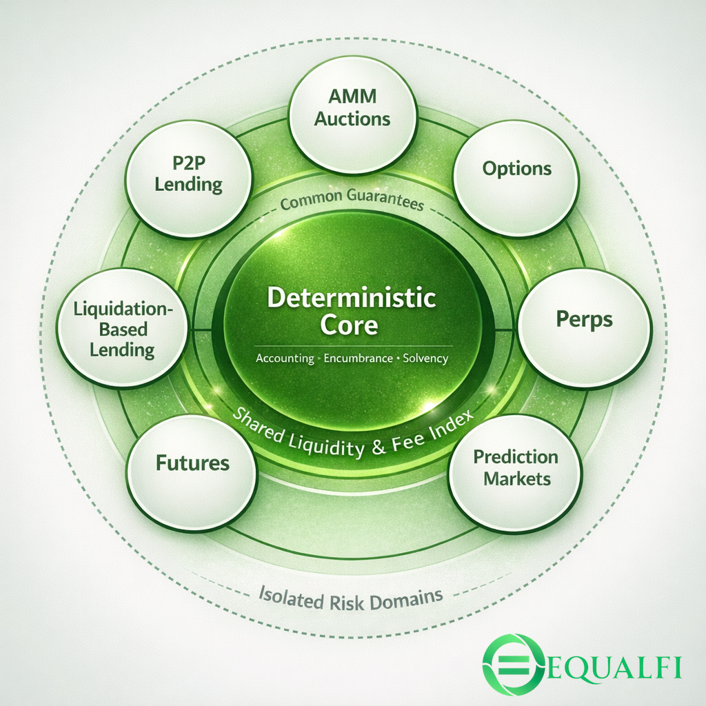
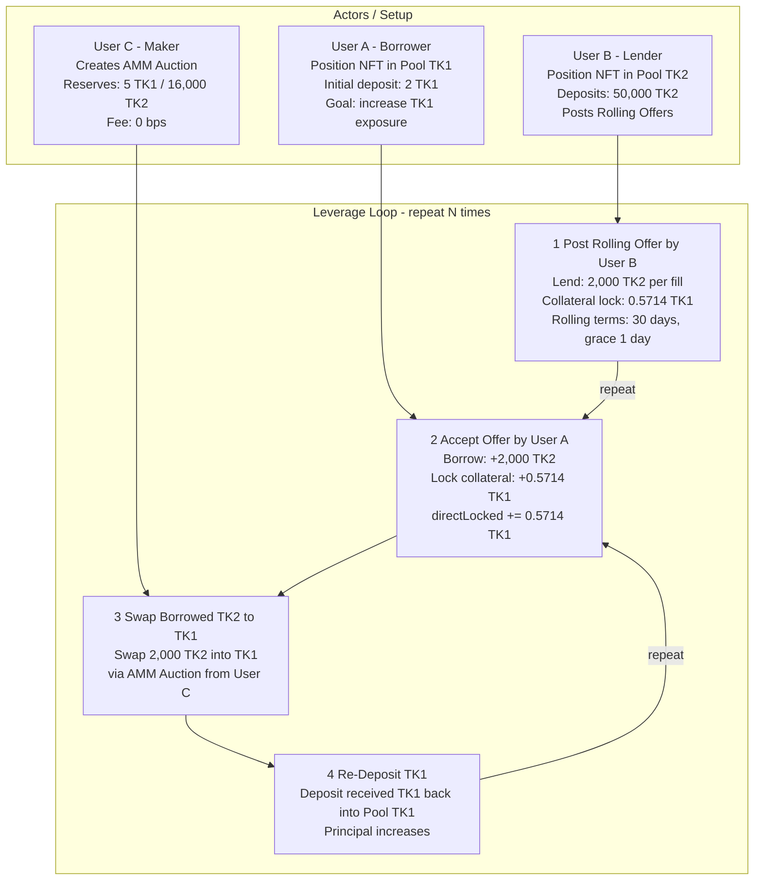

This work is inspired in part by:

[https://vitalik.eth.limo/general/2025/09/21/low_risk_defi.html](https://vitalik.eth.limo/general/2025/09/21/low_risk_defi.html)

[https://trustlessness.eth.limo/general/2025/11/11/the-trustless-manifesto.html](https://trustlessness.eth.limo/general/2025/11/11/the-trustless-manifesto.html)

***We must build for the right reasons.***

> Status: early-stage

## What is The Equalis Protocol

I am building something different at EqualFi. For a decade Decentralized Finance has been growing and evolving. Great progress has been made but a "status quo" has come to exist that seems to have become accepted. The idea that liquidation based lending is the only safe way to do decentralized credit on chain and that venues need to be separated to contain risk has become the accepted state of things. No single platform offers a full financial stack OS and almost every platform subscribes to the status quo that I am describing. There are some out there who are building against the grain and we salute them because like us they believe that there are other ways.

The goal of this project is to explore the idea that not only are other ways possible, but that they scale better and arguably provide an overall better and more stable user experience for both retail and professional users.

## A Deterministic Core

Current systems are mostly reactive. They act when markets shift and they force users to be constantly vigilant when maintaining any sort of leveraged position. If a user wants to utilize their capital by borrowing against it they are in a constant battle with the market, forever forced to monitor a health factor, because if they do not they risk getting liquidated through no fault of their own. This makes long term position planning stressful and completely hands on.

What if you could borrow without worrying about a health factor? What if you could borrow at 95% LTV? What if I told you that any asset with an Equalis pool can be supported permissionlessly?

All of that is possible if you are willing to rethink how things are currently done. The way to do this boils down to one thing: User Agency.

The Equalis Protocol core is deterministic and offers **0% interest** self-secured borrowing. This is comparable to Aave’s E-Mode where you borrow like assets that correlate in price, like stablecoin for stablecoin. Here you can draw credit from your own deposit, but the true value of the protocol is that active credit is **rewarded**. We can allow 0% interest loans at a 95% LTV because they are self secured. No oracles, no liquidation markets required for solvency, and because active credit earns, you can treat it like an additional yield source while deploying your capital elsewhere (or within Equalis).

What if you want to borrow an asset you do not own? This is where we introduce true peer to peer lending. Institutions are coming on-chain at an increasingly fast rate. This is not speculation, this is reality. The Equalis peer to peer system is designed for this type of activity but is open to anyone. You can service revolving credit for users and have steady monthly income, you can service term loans that pay interest up front and are collateralized to a ratio that you decide. As a borrower you can post an offer and wait for a lender to pick it up to be filled.

Is it more hands on? Yes. But the whole issue with Traditional Finance in the first place is using the guise of safety to extract. I am not trying to call any one project out but a spade is a spade. An intermediary is an intermediary. It is time users took their sovereignty.

## The Fee Index and Encumbrance System - Attacking Liquidity Fragmentation

Liquidity fragmentation and idle collateral are major hurdles in DeFi today. The Equalis protocol aims to attack this head on. It does this by enforcing one pool per asset globally and by directing revenue back to that single source of liquidity.

EqualFi’s core is deterministic but it allows opt-in modules that can contain classical reactive systems. The system is perfectly capable of maintaining deterministic solvency while supporting any module or venue built on top not only by the protocol but by builders themselves. The protocol is designed to be built upon while socializing liquidity and revenue for the whole system.

Socialize the gains, not the risk.

How do you achieve this while keeping risk contained? The answer is the Equalis **encumbrance** system. When capital is deployed on a venue your funds never actually leave the liquidity pool. They are simply marked as encumbered. You can also think of this as internal accounting, because most token transactions on platform are internal ledger moves and not token transfers. This not only saves on gas but allows us to keep liquidity unified for things such as flash loans.

## Dual Index System - Fee Index and Active Credit Index

Equalis routes value back to participants through a dual index system. The goal is simple: reward passive liquidity without starving the people who actually put capital to work. In most DeFi designs you either earn by doing nothing, or you earn by taking on risk, but the protocol does not cleanly separate the two. Equalis does, and it does it without relying on emissions as the primary incentive engine.

The Fee Index is the passive leg. If you deposit into an Equalis pool and do nothing else, you earn a share of protocol revenue attributed to that pool. As activity happens across the system, fees are routed back and credited to depositors through the index. It is designed to be monotonic and account-based. You are not chasing farms or claiming rewards on a schedule. Your position simply accrues a larger claim over time.

The Active Credit Index is the active leg. Equalis treats deployed capital as valuable, not suspicious. Borrowing, underwriting, and other forms of active credit expand what the system can do, so the protocol rewards that participation with a separate index stream. This is where strategies like self-secured borrowing, P2P lending, and module participation get their additional reward exposure. Active credit is not a free lunch and it is not designed to be trivially farmed. The system uses time gating and weighting rules so short-lived, low-effort cycling does not dominate long-term participation.

The key design choice is that these indices are separate. Pure depositors are not diluted by active credit loops, and active participants are not forced to compete with passive liquidity for the same single reward stream. You can choose your posture. Deposit and stay passive, deposit and borrow against yourself, lend to others, allocate inventory to markets, or do all of the above. The accounting stays coherent, and the reward system stays honest about what it is paying for.

This is how Equalis attacks fragmentation at the incentive layer. When every venue feeds the same indices, you do not have to pick one product and abandon the rest of the system. You can move capital around internally, change strategies, and still maintain exposure to protocol-wide activity. In a world where liquidity is always trying to escape to wherever the incentives are today, the dual index system is designed to make the incentives follow the activity instead.

## The Position NFT - An all-in-one balance sheet

In DeFi today, if you want to borrow you use Platform A. If you want prediction markets you move capital to Platform B, and the moment you do, your capital stops being productive back on Platform A. You end up managing a scattered set of balances, approvals, positions, and yield sources across multiple venues.

Equalis tackles this with shared architecture and internal accounting. You can deposit once, then allocate capital across venues inside the protocol. Move inventory from an AMM Auction to a prediction market? That is an internal ledger move. Your capital does not bounce between wallets and contracts, and you do not lose Fee Index or Active Credit Index exposure just because you changed what your capital is doing.

Want to borrow and deploy that liquidity elsewhere? No problem. Self-secured credit lets you draw liquidity at 0% interest, and active credit participation can earn Active Credit Index rewards. Want to hedge and write covered calls or puts? You can do that on-platform without sacrificing system-wide yield exposure.

All of this is contained inside a single account container represented by a Position NFT. Your deposits, liabilities, AMM positions, options, and claims to future yield are keyed to the NFT. Transfer the NFT, and you transfer the entire balance sheet.

That opens up secondary market possibilities that are hard to do cleanly today: distressed credit positions, engineered leverage loops, or even fully packaged market-making books that can be transferred as a single object.

A useful mental model is an apartment building. The building is the shared multi-asset system. Your Position NFT is your key. Your “unit” is your position, with its own assets and obligations. Residents share the building’s utilities, and the protocol routes value back to participants through the same fee rails.

## EqualIndex

EqualIndex is a permissionless index token primitive for creating static, fully-backed basket tokens.

It is not an actively managed product. There is no rebalancing, no changing weights, and no governance committee steering the composition over time. An index is defined once at creation and its bundle stays fixed forever. If you want a different basket, you create a different index.

Each EqualIndex token represents a fixed bundle of underlying assets on a 1e18 index unit scale. There is no oracle needed to tell you what the index is worth. Value is determined by deterministic accounting: your pro-rata share of the index vault backing, plus your pro-rata share of accumulated fee pots, minus burn fees. The vault is the NAV backing. The fee pots are where index holders get paid.

Index creation is permissionless for a creation fee, and every underlying asset must already have an Equalis pool. This keeps the system coherent: fee routing has a home, Position integration stays consistent, and indexes remain composable inside the wider protocol.

EqualIndex tracks two balances per underlying asset: vault backing and a fee pot. Minting deposits the exact underlying bundle amounts into the vault and collects per-asset mint fees. Burning redeems your proportional share of the vault and your share of the fee pots, and collects per-asset burn fees. Index holders are paid through fee pots realized on redemption. Fee Index is earned by pool members, not by passive holding.

The fee system is intentionally simple. Every mint, burn, and flash loan fee is split into two parts. One part is routed back into the system through the fee router, where it is split between Treasury, Active Credit Index, and the Fee Index for the underlying asset pool. The rest goes into the fee pot for that asset and accumulates for index holders. Mint and burn fees use a higher pool-share by default, while flash loans use a smaller one. EqualIndex also supports minting and burning using Position collateral through the encumbrance system, and those Position-based flows route fees slightly differently to keep accounting tight and avoid accidental double routing.

Here is a concrete example. Imagine an index that contains stETH and WETH. You mint 1.0 index unit and, for simple numbers, the mint fee collected for stETH is 1.00 stETH. If the pool-share is 40%, then 0.40 stETH is routed through the fee router into Treasury, ACI, and the stETH pool Fee Index, and 0.60 stETH goes into the index’s stETH fee pot. Over time, those fee pots accumulate, and when you burn your index tokens you receive your pro-rata share of the pot alongside your share of the backing vault.

EqualIndex also supports basket flash loans. Instead of borrowing a single asset, a borrower can atomically borrow the proportional amounts of every underlying asset that make up a chosen number of index units, use that inventory for arbitrage or multi-leg execution, and return the full basket in the same transaction plus fees. This turns an index into more than a passive basket. It becomes a deterministic liquidity primitive for bundling and unbundling exposure on demand. Basket flash loan fees follow the same routing model as other index fees: a configured share is routed through the fee router into Treasury, Active Credit Index, and the relevant pool Fee Index, while the remainder accrues to the index fee pots for redeemers.

EqualIndex is deliberately boring in the right ways: fixed baskets, transparent backing, permissionless creation, deterministic redemption, and fee flows that reward the people who actually supply liquidity and participate in the system.

## EqualLend - Self Secured Credit and P2P Lending

EqualLend is the credit layer of Equalis. It is built around a simple premise: borrowing should not require constant vigilance, and credit should be explicit about who is taking what risk.

It starts with Self Secured Credit. This is the deterministic core. You can borrow the same asset you deposited, bounded by a fixed LTV, at 0% interest. There is no oracle dependency and no liquidation market required to keep the position solvent, because the debt is secured by your own principal in the same asset. The goal here is not to lure leverage farmers. It is to give long-term holders a clean way to unlock liquidity and amplify yield without turning their life into a health factor monitoring job. Borrowed inventory can be deployed anywhere, including outside the protocol, and active credit participation can earn Active Credit Index rewards while your remaining unencumbered equity continues to earn the Fee Index.

When you want to borrow an asset you do not already own, EqualLend shifts from deterministic to explicit. This is where peer-to-peer lending comes in. Instead of pooled credit with hidden parameters, Equalis Direct lets lenders and borrowers define the deal: collateral ratios, terms, maturities, payment schedules, and pricing. Borrowers can post offers and wait to be filled. Lenders can run strategies that look like real credit desks: revolving credit, term loans, structured repayment, or managed pools offering standardized products. This is open to anyone, and it also supports professional workflows without requiring privileged access.

The most interesting consequence of P2P lending is that it enables perpetual leverage in the literal sense: continuous leverage on a position over time. In most DeFi systems, leverage is maintained by reactive liquidation thresholds. A wick happens, an oracle blips, and the position is force-closed at the worst moment. Equalis Direct does not need to work that way. Because credit is expressed as a contract, leverage can be maintained through rolling agreements and payment terms rather than oracle-triggered liquidations. If both parties are willing to hold through volatility, there is no automatic forced selling just because the market temporarily moved against you. Your position can survive the drawdown, stay alive, and recover. Time in market becomes a strategy variable again.

This is not a promise of safety. It is a different enforcement model. Risk does not disappear, it becomes legible. Lenders decide whether they want strict collateralization, softer terms, covenants, callable structures, or even undercollateralized credit for vetted clients where real-world underwriting exists above the protocol. Borrowers choose the deal they are willing to live with. Defaults are handled as defaults, not as third-party liquidation opportunities.

EqualLend is designed to serve both ends of the spectrum. It gives ordinary users a predictable way to unlock liquidity without being hunted by liquidation bots, and it gives professional lenders and market makers a credit framework that can support real structured products. And because active credit is rewarded through the Active Credit Index, the system aligns incentives around the work that actually expands what the protocol can do.

## Perpetual Leverage Loop

The below flowchart is a concrete example of how one can achieve a _**PERPETUAL LEVERAGE LOOP**_ . In this case perpetual leverage means exactly what it is.  A leverage loop that can be maintained indefinitely regardless of market conditions.

This is achieved using P2P Revolving loans, AMM Auction Swaps and Redeposits. This creates leverage that is immune to price changes.

## Road to Immutability

Equalis is being built with a constraint that most protocols only talk about: the walkaway test. The system should be able to keep running even if the team disappears, the social layer collapses, or nobody is left to “manage” it. That does not happen by writing a manifesto. It happens by removing knobs over time.

We are launching in phases because reality exists. Early-stage protocols need the ability to patch bugs, harden invariants, and respond to unexpected edge cases. The difference is that Equalis treats upgradeability as a temporary scaffolding, not a permanent control surface.

Equalis uses a modular diamond architecture. In the early phases, modules ship as facets behind upgradeable selectors so we can iterate quickly and fix what breaks. As a facet stabilizes, the plan is to progressively freeze it. Freezing means locking selectors and preventing further code changes for that surface area. Over time, fewer selectors remain mutable. More of the protocol becomes fixed infrastructure.

This happens module by module, not all at once. The core accounting, pool logic, and critical invariants get frozen first. Higher-risk or more experimental modules freeze later, after they have survived real usage and adversarial testing. Eventually the only parameters that remain adjustable are fee-related, and even those will have hard-coded bounds. If something can be abused, it should not be a knob. If something must be a knob, it should be bounded.

The end state is simple: the protocol becomes boring. Not “stagnant,” but predictable. Users should be able to build on Equalis knowing that rules will not change under their feet, and that no governance vote or admin key can rewrite the ground truth. Upgrades become the exception, not the expectation.

That is the path: ship in phases, prove stability in production, and progressively remove ourselves from the trust model until Equalis is infrastructure you can rely on, not a product you are renting.

## The Mission Statement

I’m not building Equalis to play the usual game.

Across DeFi, “safety” often means forced unwinds, opaque risk, and value extraction disguised as protection. When users get hurt, they get told they should have known better. That story might be convenient, but it’s not good enough.

Equalis exists because trustlessness has to be real. Not a brand. Not a vibe. A system that can survive without intermediaries, without permission, and without permanent babysitting. A protocol that can pass the walkaway test, not just talk about it.

If you’re a builder, a user, or someone who wants to see onchain finance done differently, welcome. If you’re tired of hearing that the way things are is the way they have to be, you’re in the right place.

Discord: [https://discord.gg/brsMNDux4T](https://discord.gg/brsMNDux4T)

