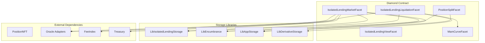
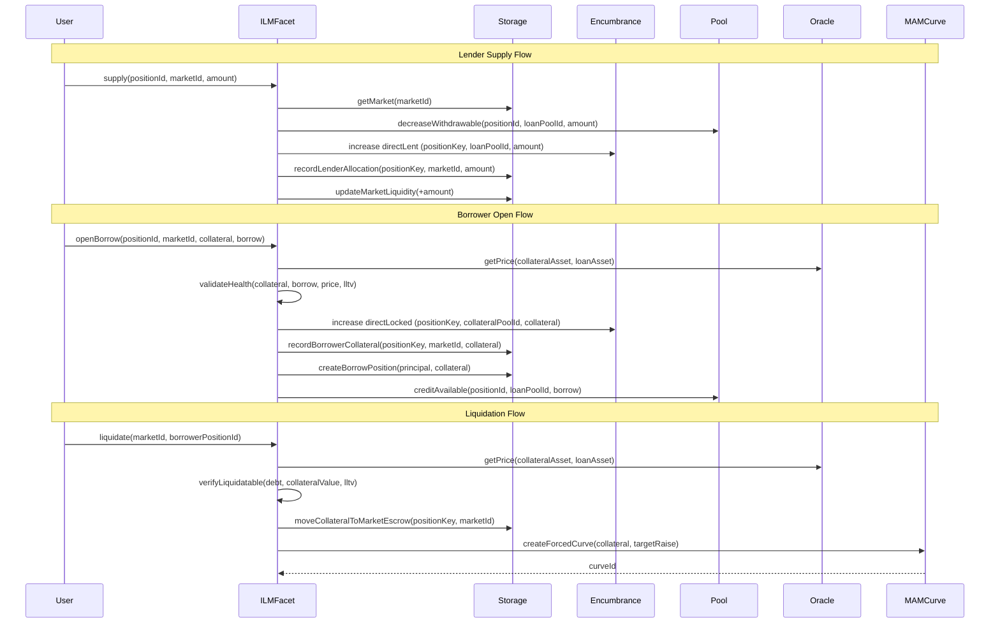

# Design Document: Isolated Lending Markets

## Overview

Equalis Isolated Lending Markets V1 introduces permissionless, isolated lending markets that enable cross-asset borrowing while maintaining strict isolation through encumbrance. This design leverages the existing Position NFT infrastructure, pool system, and centralized encumbrance to create a robust lending protocol where stress in one market cannot spread to unrelated liquidity.

The system follows the Diamond pattern used throughout Equalis, implementing new facets for market management, lending operations, and liquidation handling. All positions and claims live inside Position NFTs, with a new Position Split primitive enabling partial exits without receipt tokens.

## Architecture

### High-Level Architecture



### Component Interaction Flow



## Components and Interfaces

### IsolatedLendingMarketFacet

Primary facet handling market creation, supply, withdraw, borrow, and repay operations.

```solidity
interface IIsolatedLendingMarketFacet {
    // Market Creation
    function createMarket(IsolatedMarketParams calldata params) external payable returns (uint256 marketId);
    
    // Lender Operations
    function supply(uint256 positionId, uint256 marketId, uint256 amount) external;
    function withdraw(uint256 positionId, uint256 marketId, uint256 amount) external returns (uint256 withdrawn);
    
    // Borrower Operations
    function openBorrow(
        uint256 positionId,
        uint256 marketId,
        uint256 collateralAmount,
        uint256 borrowAmount
    ) external;
    function repay(uint256 positionId, uint256 marketId, uint256 amount) external;
    function addCollateral(uint256 positionId, uint256 marketId, uint256 amount) external;
    function removeCollateral(uint256 positionId, uint256 marketId, uint256 amount) external;
}
```

### IsolatedLendingLiquidationFacet

Handles liquidation initiation, MAM curve creation, and settlement.

```solidity
interface IIsolatedLendingLiquidationFacet {
    function liquidate(uint256 marketId, uint256 borrowerPositionId) external returns (uint256 curveId);
    function settleLiquidation(uint256 marketId, uint256 borrowerPositionId) external;
    function retryLiquidation(uint256 marketId, uint256 borrowerPositionId) external returns (uint256 curveId);
}
```

### IsolatedLendingViewFacet

Read-only functions for querying market and position state.

```solidity
interface IIsolatedLendingViewFacet {
    function getMarket(uint256 marketId) external view returns (IsolatedMarket memory);
    function getBorrowPosition(uint256 marketId, uint256 positionId) external view returns (IsolatedBorrowPosition memory);
    function previewHealth(uint256 marketId, uint256 positionId) external view returns (uint256 healthFactor);
    function previewLiquidation(uint256 marketId, uint256 positionId) external view returns (LiquidationPreview memory);
    function getLenderAllocation(uint256 marketId, uint256 positionId) external view returns (uint256);
    function getMarketUtilization(uint256 marketId) external view returns (uint256 utilizationBps);
}
```

### PositionSplitFacet

Handles Position NFT splitting for partial exits.

```solidity
interface IPositionSplitFacet {
    function splitPosition(uint256 positionId, SplitPlan calldata plan) external returns (uint256 newPositionId);
}

struct SplitPlan {
    MoveAvailable[] moveAvailable;
    MoveMarketAllocation[] moveEncumbrances;
}

struct MoveAvailable {
    uint256 poolId;
    uint256 amount;
}

struct MoveMarketAllocation {
    uint256 poolId;
    uint256 marketId;
    bytes32 role;
    uint256 amount; // For V1, must be full allocation amount or 0
}
```

### Oracle Adapter Interface

```solidity
interface IOracleAdapter {
    function getPrice(address baseAsset, address quoteAsset) external view returns (uint256 price, uint256 timestamp);
    function isStale(address baseAsset, address quoteAsset) external view returns (bool);
    function decimals() external view returns (uint8);
}
```

### Liquidation Template Interface

```solidity
struct LiquidationTemplate {
    uint16 discountBps;      // Discount from oracle price for effective price
    uint16 bufferBps;        // Buffer added to collateral calculation
    uint64 durationSeconds;  // Auction duration
    uint16 startPriceBps;    // Start price relative to oracle (e.g., 11000 = 110%)
    uint16 endPriceBps;      // End price relative to oracle (e.g., 8000 = 80%)
    uint32 tickSeconds;      // Optional discrete fill intervals (0 = continuous)
}
```

## Data Models

### Storage Structures

```solidity
library IsolatedLendingTypes {
    enum BorrowStatus {
        Active,
        InLiquidation,
        Liquidated,
        Closed
    }
    
    struct IsolatedMarket {
        // Immutable parameters
        uint256 loanPoolId;
        uint256 collateralPoolId;
        uint256 oracleId;
        uint16 lltvBps;
        uint16 aprBps;
        uint256 liqTemplateId;
        
        // Fee configuration
        uint16 borrowFeeBps;
        uint16 liquidationFeeBps;
        uint16 liquidationPenaltyBps;
        uint16 feeIndexShareBps;
        // Treasury share is applied first using the global split; feeIndexShareBps applies to the remainder,
        // and any leftover stays in market liquidity for lenders.
        
        // Market state
        uint256 totalLenderEncumberedA;
        uint256 availableLiquidityA;
        uint256 totalBorrowedA;
        uint256 totalCollateralB;
        uint256 badDebtA;
        uint64 lastAccrualTimestamp;
        bool active;
    }
    
    struct IsolatedBorrowPosition {
        uint256 principal;
        uint256 collateralAmount;
        uint64 openedAt;
        uint64 lastAccrualTimestamp;
        uint256 accruedInterest;
        BorrowStatus status;
        uint256 liquidationCurveId; // Set when InLiquidation
    }
    
    struct IsolatedMarketParams {
        uint256 loanPoolId;
        uint256 collateralPoolId;
        uint256 oracleId;
        uint16 lltvBps;
        uint16 aprBps;
        uint256 liqTemplateId;
        uint16 borrowFeeBps;
        uint16 liquidationFeeBps;
        uint16 liquidationPenaltyBps;
    }
    
    struct LiquidationPreview {
        uint256 debtA;
        uint256 collateralB;
        uint256 collateralValueA;
        uint256 targetRaiseA;
        uint256 collateralToSellB;
        bool isLiquidatable;
    }
}
```

### Storage Layout

```solidity
library LibIsolatedLendingStorage {
    bytes32 internal constant STORAGE_POSITION = keccak256("equalis.isolated.lending.storage");
    
    struct IsolatedLendingStorage {
        // Configuration
        uint256 marketCreationFee;
        uint16 minLltvBps;
        uint16 maxLltvBps;
        uint16 minAprBps;
        uint16 maxAprBps;
        
        // Allowlists
        mapping(uint256 => bool) allowedOracles;
        mapping(uint256 => LiquidationTemplate) liquidationTemplates;
        mapping(uint256 => bool) allowedTemplates;
        
        // Markets
        uint256 nextMarketId;
        mapping(uint256 => IsolatedMarket) markets;
        
        // Borrow positions: marketId => positionKey => BorrowPosition
        mapping(uint256 => mapping(bytes32 => IsolatedBorrowPosition)) borrowPositions;

        // Market ledger
        mapping(uint256 => mapping(bytes32 => uint256)) lenderAllocations;
        mapping(uint256 => mapping(bytes32 => uint256)) borrowerCollateral;
        mapping(uint256 => mapping(bytes32 => uint256)) liquidationEscrow;
        
        // Tracking lists
        LibPositionList.List marketsByLoanPool;
        LibPositionList.List marketsByCollateralPool;
        LibPositionList.List borrowersByMarket;
        LibPositionList.List lendersByMarket;
    }
    
    function s() internal pure returns (IsolatedLendingStorage storage ds) {
        bytes32 position = STORAGE_POSITION;
        assembly {
            ds.slot := position
        }
    }
}
```

### Market Ledger Accounting

Isolated lending uses the centralized encumbrance buckets:

* `LibEncumbrance.position(positionKey, poolId).directLent` for lender opt-in capital
* `LibEncumbrance.position(positionKey, poolId).directLocked` for borrower collateral

Market-specific state is tracked in the isolated lending storage ledger:

* `lenderAllocations[marketId][positionKey]` for lender exposures
* `borrowerCollateral[marketId][positionKey]` for collateral attributed to the market
* `liquidationEscrow[marketId][positionKey]` for collateral under liquidation

The ledger is authoritative for per-market accounting and liquidation escrow, while direct principals preserve pool withdrawal safety.

### Interest Calculation

```solidity
library LibIsolatedInterest {
    uint256 internal constant SECONDS_PER_YEAR = 365 days;
    uint256 internal constant BPS_SCALE = 10000;
    
    /// @notice Calculate accrued interest for a borrow position
    /// @param principal The principal amount
    /// @param aprBps Annual percentage rate in basis points
    /// @param lastAccrual Timestamp of last accrual
    /// @param currentTime Current timestamp
    /// @return interest The accrued interest amount
    function calculateInterest(
        uint256 principal,
        uint16 aprBps,
        uint64 lastAccrual,
        uint64 currentTime
    ) internal pure returns (uint256 interest) {
        if (currentTime <= lastAccrual) return 0;
        uint256 dt = currentTime - lastAccrual;
        interest = (principal * aprBps * dt) / (SECONDS_PER_YEAR * BPS_SCALE);
    }
}
```


## Correctness Properties

*A property is a characteristic or behavior that should hold true across all valid executions of a system—essentially, a formal statement about what the system should do. Properties serve as the bridge between human-readable specifications and machine-verifiable correctness guarantees.*

### Property 1: Pool Withdrawal Safety Preservation

*For any* Position NFT and any pool, after any operation (supply, withdraw, borrow, repay, liquidate, split), encumbrance accounting must preserve withdrawal safety:
`withdrawablePrincipal = principal - LibEncumbrance.total(positionKey, poolId)` remains non-negative.

**Validates: Requirements 2.6, 14.3**

### Property 2: Market Creation Validation

*For any* market creation attempt with invalid parameters (non-allowlisted oracle, out-of-bounds LLTV, out-of-bounds APR, non-allowlisted template, or insufficient ETH fee), the Lending_Market_Factory shall revert with the appropriate error.

**Validates: Requirements 1.3, 1.4, 1.5, 1.6, 1.8**

### Property 3: Market Parameter Round-Trip

*For any* valid market creation parameters, creating a market and then calling getMarket shall return the same immutable parameters that were provided at creation.

**Validates: Requirements 1.2, 15.1**

### Property 4: Supply State Consistency

*For any* valid supply operation with positionId, marketId, and amountA:
- withdrawable principal in loanPoolId decreases by exactly amountA
- LibEncumbrance.position(positionKey, loanPoolId).directLent increases by exactly amountA
- lenderAllocations[marketId][positionKey] increases by exactly amountA
- market.totalLenderEncumberedA increases by exactly amountA
- market.availableLiquidityA increases by exactly amountA

**Validates: Requirements 2.1, 2.2, 2.3**

### Property 5: Supply Insufficient Balance Rejection

*For any* supply attempt where amountA exceeds the position's withdrawable principal in the loan pool, the operation shall revert with InsufficientBalance error.

**Validates: Requirements 2.5**

### Property 6: Withdraw State Consistency

*For any* valid withdraw operation where amountA is available:
- lender allocation decreases by amountWithdrawn
- LibEncumbrance.position(positionKey, loanPoolId).directLent decreases by amountWithdrawn
- withdrawable principal in loanPoolId increases by amountWithdrawn
- market.availableLiquidityA decreases by amountWithdrawn
- market.totalLenderEncumberedA decreases by amountWithdrawn

**Validates: Requirements 3.2, 3.3, 3.4**

### Property 7: Withdraw Partial Fill

*For any* withdraw attempt where amountA exceeds availableLiquidityA, the operation shall withdraw exactly min(amountA, availableLiquidityA, lenderAllocation).

**Validates: Requirements 3.6**

### Property 8: Bad Debt Haircut Proportionality

*For any* market with recorded badDebtA and any lender withdrawal, the haircut applied shall be proportional to badDebtA / totalLenderEncumberedA.

**Validates: Requirements 3.7**

### Property 9: Borrow Health Enforcement

*For any* openBorrow attempt, if the post-borrow health check fails (DebtA_after > CollateralValueA * lltvBps / 10000), the operation shall revert with UnsafePosition error.

**Validates: Requirements 4.2, 4.10**

### Property 10: Borrow State Consistency

*For any* valid openBorrow operation:
- collateralAmountB is locked via `LibEncumbrance.position(positionKey, collateralPoolId).directLocked` and recorded in borrowerCollateral
- borrower debt principal increases by borrowAmountA
- market.availableLiquidityA decreases by borrowAmountA
- borrower withdrawable principal in loanPoolId increases by (borrowAmountA - fees)

**Validates: Requirements 4.3, 4.4, 4.5, 4.6**

### Property 11: Borrow Liquidity Check

*For any* openBorrow attempt where borrowAmountA exceeds availableLiquidityA, the operation shall revert with InsufficientLiquidity error.

**Validates: Requirements 4.9**

### Property 12: Repay State Consistency

*For any* valid repay operation:
- borrower withdrawable principal in loanPoolId decreases by repayAmountA
- debt (principal + interest) decreases by repayAmountA
- market.availableLiquidityA increases by repayAmountA

**Validates: Requirements 5.1, 5.2, 5.3**

### Property 13: Full Repay Collateral Release

*For any* repay operation that reduces debt to zero:
- collateral is fully released to borrower withdrawable principal
- borrow position status is set to Closed

**Validates: Requirements 5.4, 5.5**

### Property 14: Repay Overpayment Clamping

*For any* repay attempt where repayAmountA exceeds total debt, the operation shall only accept up to total debt amount.

**Validates: Requirements 5.7**

### Property 15: Interest Calculation Correctness

*For any* borrow position with principal P, aprBps A, and time elapsed dt seconds, the accrued interest shall equal `P * A * dt / (365 days * 10000)` within rounding tolerance.

**Validates: Requirements 6.1**

### Property 16: Health Calculation Correctness

*For any* borrow position, the health factor calculation shall correctly compute:
- DebtA = principal + accruedInterest + unpaidFees
- CollateralValueA = collateralEncumberedB * oraclePrice
- ThresholdA = CollateralValueA * lltvBps / 10000
- isLiquidatable = (DebtA > ThresholdA)

**Validates: Requirements 7.1, 7.2, 7.3, 7.4**

### Property 17: Liquidation Trigger Correctness

*For any* liquidate call on a position where DebtA <= ThresholdA, the operation shall revert with PositionHealthy error.

**Validates: Requirements 8.1, 8.6**

### Property 18: Liquidation Escrow Transition

*For any* successful liquidation initiation:
- collateral is moved into liquidationEscrow for the market ledger
- borrower status is set to InLiquidation

**Validates: Requirements 8.2, 8.3**

### Property 19: Liquidation Calculation Correctness

*For any* liquidation, the collateral to sell shall be calculated as:
- P_eff = P_oracle * (1 - discountBps/10000)
- D = DebtA + liquidationPenaltyA + liquidationFeesA
- B_to_sell = min(D / P_eff * (1 + bufferBps/10000), totalCollateralInEscrow)

**Validates: Requirements 8.4, 9.1, 9.2, 9.3**

### Property 20: Forced Curve Parameter Derivation

*For any* liquidation curve created:
- startPrice = P_oracle * startPriceBps / 10000
- endPrice = P_oracle * endPriceBps / 10000
- duration = template.durationSeconds

**Validates: Requirements 10.2, 10.3, 10.4**

### Property 21: Forced Curve Borrower Restriction

*For any* forced liquidation curve, the borrower shall not be able to cancel or modify the curve.

**Validates: Requirements 10.5, 14.4**

### Property 22: Liquidation Early Stop

*For any* liquidation where raisedA >= targetRaiseD, the auction shall stop early and release unsold collateral back to borrower.

**Validates: Requirements 10.7, 10.8**

### Property 23: Bad Debt Recording

*For any* liquidation where collateral is exhausted and raisedA < D, badDebtA = D - raisedA shall be recorded and socialized only within this market.

**Validates: Requirements 11.3, 11.4**

### Property 24: Position Split Consistency

*For any* valid splitPosition operation:
- a new Position NFT is created
- specified available balances are moved from original to new
- specified market allocations are moved from original to new (whole units only in V1)
- both Position NFTs satisfy pool invariant after split

**Validates: Requirements 12.1, 12.2, 12.3, 12.4, 12.7**

### Property 25: Split Insufficient Balance Rejection

*For any* splitPosition attempt where plan requests moving more than available, the operation shall revert with InsufficientBalance error.

**Validates: Requirements 12.6**

### Property 26: Fee Routing Correctness

*For any* fee-generating operation (borrow, liquidation):
- Treasury share is transferred out immediately using the global split
- Fee_Index receives feeIndexShareBps of the remaining fees
- Any remainder stays in market liquidity for lenders

**Validates: Requirements 13.1, 13.2, 13.3, 13.4**

### Property 27: Fee Non-Retroactivity

*For any* fee configuration change, existing borrow positions shall continue using their original fee configuration.

**Validates: Requirements 13.5**

### Property 28: Oracle Staleness Enforcement

*For any* operation requiring price data (borrow, liquidation), if the oracle reports stale data, the operation shall revert.

**Validates: Requirements 4.1, 14.5**

### Property 29: View Function Consistency

*For any* borrow position, the view functions (getBorrowPosition, previewHealth, previewLiquidation) shall return values consistent with the actual state and calculations.

**Validates: Requirements 15.2, 15.3, 15.4, 15.5**

## Error Handling

### Error Definitions

```solidity
// Market Creation Errors
error OracleNotAllowed(uint256 oracleId);
error InvalidLLTV(uint16 lltvBps, uint16 minBps, uint16 maxBps);
error InvalidAPR(uint16 aprBps, uint16 minBps, uint16 maxBps);
error TemplateNotAllowed(uint256 templateId);
error InsufficientFee(uint256 sent, uint256 required);
error MarketNotFound(uint256 marketId);

// Supply/Withdraw Errors
error InsufficientBalance(uint256 requested, uint256 available);
error InsufficientLiquidity(uint256 requested, uint256 available);
error NoLenderEncumbrance(uint256 marketId, uint256 positionId);

// Borrow/Repay Errors
error UnsafePosition(uint256 debtA, uint256 thresholdA);
error StaleOraclePrice(uint256 oracleId, uint256 lastUpdate, uint256 maxAge);
error NoBorrowPosition(uint256 marketId, uint256 positionId);
error PositionInLiquidation(uint256 marketId, uint256 positionId);

// Liquidation Errors
error PositionHealthy(uint256 healthFactor);
error LiquidationAlreadyStarted(uint256 marketId, uint256 positionId);
error LiquidationNotStarted(uint256 marketId, uint256 positionId);
error NotLiquidationCurveOwner(uint256 curveId, address caller);

// Position Split Errors
error InvalidSplitPlan();
error PartialAllocationNotAllowed(uint256 poolId, uint256 marketId, bytes32 role);

// Access Control Errors
error NotPositionOwner(uint256 positionId, address caller);
error NotGovernance(address caller);
```

### Error Handling Strategy

1. **Validation First**: All input validation occurs before state changes
2. **Atomic Operations**: Operations either complete fully or revert entirely
3. **Descriptive Errors**: Custom errors include relevant context for debugging
4. **Graceful Degradation**: Partial fills for withdrawals when liquidity is limited

## Testing Strategy

### Unit Tests

Unit tests will cover:
- Market creation with valid and invalid parameters
- Supply/withdraw edge cases (zero amounts, exact balance, partial fills)
- Borrow/repay edge cases (minimum amounts, full repayment, overpayment)
- Interest accrual timing and precision
- Health factor calculations at boundary conditions
- Liquidation trigger conditions
- Position split with various plan configurations
- Fee routing calculations

### Property-Based Tests

Property-based tests will use Foundry's fuzzing capabilities to verify:
- Pool invariant preservation across all operations
- Health calculation correctness across random positions
- Interest accrual formula correctness
- Liquidation calculation correctness
- State consistency properties for all operations

Each property test will:
- Run minimum 100 iterations
- Use constrained random inputs within valid ranges
- Reference the specific design property being tested
- Tag format: **Feature: isolated-lending-markets, Property {number}: {property_text}**

### Integration Tests

Integration tests will cover:
- Full lending lifecycle (create market → supply → borrow → repay → withdraw)
- Liquidation lifecycle (borrow → price drop → liquidate → settle)
- Position split and secondary transfer scenarios
- Multi-market isolation verification
- Bad debt socialization scenarios

### Test Framework

- **Framework**: Foundry (forge test)
- **Property Testing**: Foundry's built-in fuzzing
- **Coverage Target**: 90%+ line coverage for core logic
- **Gas Benchmarks**: Track gas costs for all user-facing operations
