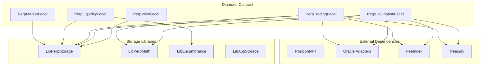
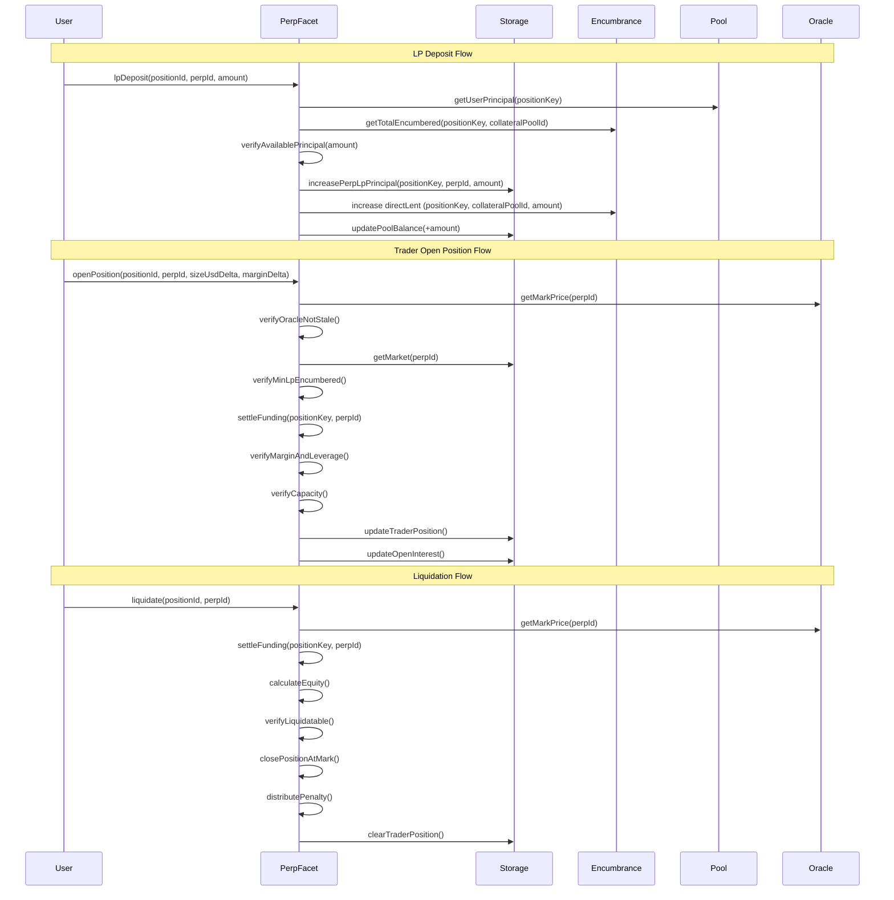

# Design Document: Isolated Perpetual Pools

## Overview

Equalis Perpetual Pool V1 introduces opt-in perpetual trading as an isolated spoke that draws capacity from Equalis single-asset pools without exposing passive depositors to perp PnL. The system leverages the existing Position NFT infrastructure, pool system, and centralized encumbrance to create isolated perpetual markets where LPs explicitly underwrite trader PnL.

The system follows the Diamond pattern used throughout Equalis, implementing new facets for market management, LP operations, trader operations, and liquidation handling. All positions and claims live inside Position NFTs, with perps tracking stored in `LibPerpStorage` while withdrawal safety is enforced via `LibEncumbrance`.

Key design principles:
- **Isolation by locking**: LP capital uses `LibEncumbrance.position(positionKey, poolId).directLent` and trader margin uses `LibEncumbrance.position(positionKey, poolId).directLocked`
- **Oracle-based pricing**: V1 uses oracle mark price only, no internal AMM
- **Deterministic liquidation**: Positions are closed at oracle mark price without auction
- **Stablecoin settlement**: V1 requires collateral pool to be a stablecoin for direct USD accounting

## Architecture

### High-Level Architecture



### Component Interaction Flow



## Components and Interfaces

### PerpMarketFacet

Handles market creation and configuration.

```solidity
interface IPerpMarketFacet {
    function createPerpMarket(PerpMarketParams calldata params) external returns (uint256 perpId);
    function setOracleAllowlist(uint256 oracleId, bool allowed) external;
    function setMarketBounds(PerpMarketBounds calldata bounds) external;
}

struct PerpMarketParams {
    uint256 collateralPoolId;
    uint256 indexOracleId;
    PerpRiskConfig riskConfig;
    PerpFundingConfig fundingConfig;
    PerpFeeConfig feeConfig;
}

struct PerpRiskConfig {
    uint32 maxLeverageBps;           // e.g., 100_000 = 10x
    uint16 maintenanceMarginBps;     // e.g., 500 = 5%
    uint16 minInitialMarginBps;      // e.g., 1000 = 10%
    uint256 maxOpenInterestUsd;      // optional cap, 0 = uncapped
    uint256 minLpEncumbered;         // min LP collateral before trading
    uint16 shockBufferBps;           // per-market stress buffer
}

struct PerpFundingConfig {
    uint16 fundingRateBpsPerDay;     // base rate
    uint16 maxFundingRateBpsPerDay;  // hard cap
    uint16 imbalanceMultiplierBps;   // linear multiplier
    uint32 fundingIntervalSeconds;   // e.g., 3600 = 1 hour
}

struct PerpFeeConfig {
    uint16 tradeFeeBps;
    uint16 liqPenaltyBps;
    uint16 feeIndexSplitBps;
    uint16 liquidatorSplitBps;       // remainder split to liquidator (rest to LPs)
}

// Treasury share is applied first using the global split; the remaining fee amount is split by feeIndexSplitBps/liquidatorSplitBps.
```

### PerpLiquidityFacet

Handles LP deposit and withdrawal operations.

```solidity
interface IPerpLiquidityFacet {
    function lpDeposit(uint256 positionId, uint256 perpId, uint256 amount) external;
    function lpWithdraw(uint256 positionId, uint256 perpId, uint256 amount) external;
}
```

### PerpTradingFacet

Handles trader position operations.

```solidity
interface IPerpTradingFacet {
    function openPosition(
        uint256 positionId,
        uint256 perpId,
        int256 sizeUsdDelta,
        int256 marginDelta
    ) external;
    function closePosition(uint256 positionId, uint256 perpId) external;
    function addMargin(uint256 positionId, uint256 perpId, uint256 amount) external;
    function removeMargin(uint256 positionId, uint256 perpId, uint256 amount) external;
}
```

### PerpLiquidationFacet

Handles liquidation execution.

```solidity
interface IPerpLiquidationFacet {
    function liquidate(uint256 positionId, uint256 perpId) external;
}
```

### PerpViewFacet

Read-only functions for querying state.

```solidity
interface IPerpViewFacet {
    function getPerpMarket(uint256 perpId) external view returns (PerpMarket memory);
    function getPosition(uint256 perpId, uint256 positionId) external view returns (TraderPosition memory);
    function getMarkPrice(uint256 perpId) external view returns (uint256 price, uint256 timestamp);
    function previewPnL(uint256 perpId, uint256 positionId) external view returns (int256 unrealizedPnL, int256 fundingOwed);
    function previewLiquidation(uint256 perpId, uint256 positionId) external view returns (LiquidationPreview memory);
    function getFreeLiquidity(uint256 perpId) external view returns (uint256);
    function getCapacity(uint256 perpId) external view returns (uint256 remainingOI);
    function previewHealth(uint256 perpId, uint256 positionId) external view returns (uint256 equity, uint256 required, bool isLiquidatable);
}
```

### Oracle Adapter Interface

```solidity
interface IPerpOracleAdapter {
    function getPrice(uint256 perpId) external view returns (uint256 price, uint256 timestamp);
    function isStale(uint256 perpId) external view returns (bool);
    function decimals() external view returns (uint8);
}
```

## Data Models

### Storage Structures

```solidity
library PerpTypes {
    enum PositionStatus {
        None,
        Open,
        Liquidatable,
        Closed
    }
    
    struct PerpMarket {
        // Immutable parameters
        uint256 collateralPoolId;
        uint256 indexOracleId;
        PerpRiskConfig riskConfig;
        PerpFundingConfig fundingConfig;
        PerpFeeConfig feeConfig;
        
        // Market state
        uint256 totalLpEncumbered;
        uint256 poolBalance;
        uint256 openInterestLongUsd;
        uint256 openInterestShortUsd;
        int256 cumulativeFundingIndex;  // signed, scaled by 1e18
        uint64 lastFundingTime;
        uint256 treasuryFeesAccrued;
        uint256 feeIndexAccrued;
        uint256 badDebt;
        bool active;
    }
    
    struct TraderPosition {
        int256 sizeUsd;                 // signed: positive = long, negative = short
        uint256 entryPrice;             // oracle price at entry (scaled)
        uint256 marginCollateral;       // locked margin amount
        int256 fundingEntryIndex;       // funding index at last settlement
        uint64 lastUpdateTime;
        PositionStatus status;
    }
    
    struct LiquidationPreview {
        int256 unrealizedPnL;
        int256 fundingOwed;
        uint256 equity;
        uint256 requiredMargin;
        uint256 penalty;
        uint256 liquidatorReward;
        bool isLiquidatable;
    }
}
```

### Storage Layout

```solidity
library LibPerpStorage {
    bytes32 internal constant STORAGE_POSITION = keccak256("equalis.perp.storage");
    
    struct PerpStorage {
        // Configuration
        mapping(uint256 => bool) allowedOracles;
        PerpMarketBounds bounds;
        
        // Markets
        uint256 nextPerpId;
        mapping(uint256 => PerpTypes.PerpMarket) markets;
        
        // Trader positions: perpId => positionKey => TraderPosition
        mapping(uint256 => mapping(bytes32 => PerpTypes.TraderPosition)) traderPositions;
        
        // LP locked principal: positionKey => perpId => amount
        mapping(bytes32 => mapping(uint256 => uint256)) perpLpPrincipal;
        
        // Trader locked margin: positionKey => perpId => amount
        mapping(bytes32 => mapping(uint256 => uint256)) perpTraderMargin;

        // Encumbrance is tracked in LibEncumbrance (directLent/directLocked) by positionKey + poolId
        
        // Tracking lists
        LibPositionList.List lpsByPerp;
        LibPositionList.List tradersByPerp;
    }
    
    struct PerpMarketBounds {
        uint32 minLeverageBps;
        uint32 maxLeverageBps;
        uint16 minMaintenanceMarginBps;
        uint16 maxMaintenanceMarginBps;
        uint16 minInitialMarginBps;
        uint16 maxInitialMarginBps;
        uint16 maxTradeFeeBps;
        uint16 maxLiqPenaltyBps;
        uint16 minShockBufferBps;
        uint16 maxShockBufferBps;
        uint16 maxLiquidatorSplitBps;
    }
    
    function s() internal pure returns (PerpStorage storage ps) {
        bytes32 position = STORAGE_POSITION;
        assembly {
            ps.slot := position
        }
    }
}
```

### Available Principal Calculation

```solidity
library LibPerpHelpers {
    /// @notice Calculate available principal for a position in a pool
    /// @dev Available = userPrincipal - LibEncumbrance.total(positionKey, poolId)
    function getAvailablePrincipal(
        bytes32 positionKey,
        uint256 poolId
    ) internal view returns (uint256 available) {
        Types.PoolData storage pool = LibAppStorage.s().pools[poolId];
        uint256 userPrincipal = pool.userPrincipal[positionKey];
        uint256 totalLocked = LibEncumbrance.total(positionKey, poolId);
        available = userPrincipal > totalLocked ? userPrincipal - totalLocked : 0;
    }
}
```

### PnL Calculation

```solidity
library LibPerpMath {
    uint256 internal constant PRICE_SCALE = 1e18;
    uint256 internal constant BPS_SCALE = 10000;
    uint256 internal constant FUNDING_WAD = 1e18;
    
    /// @notice Calculate unrealized PnL for a position
    /// @param sizeUsd Signed notional size (positive = long, negative = short)
    /// @param entryPrice Entry price (scaled)
    /// @param markPrice Current mark price (scaled)
    /// @return pnl Signed PnL in USD
    function calculateUnrealizedPnL(
        int256 sizeUsd,
        uint256 entryPrice,
        uint256 markPrice
    ) internal pure returns (int256 pnl) {
        if (sizeUsd == 0 || entryPrice == 0) return 0;
        
        // qty = sizeUsd / entryPrice (synthetic underlying amount)
        // pnl = qty * (markPrice - entryPrice)
        // Simplified: pnl = sizeUsd * (markPrice - entryPrice) / entryPrice
        
        int256 priceDelta = int256(markPrice) - int256(entryPrice);
        pnl = (sizeUsd * priceDelta) / int256(entryPrice);
    }
    
    /// @notice Calculate funding payment for a position
    /// @param sizeUsd Signed notional size
    /// @param fundingDeltaWad Change in cumulative funding index (signed, 1e18)
    /// @return payment Signed payment (positive = trader pays, negative = trader receives)
    function calculateFundingPayment(
        int256 sizeUsd,
        int256 fundingDeltaWad
    ) internal pure returns (int256 payment) {
        if (sizeUsd == 0) return 0;
        
        int256 absSize = sizeUsd > 0 ? sizeUsd : -sizeUsd;
        int256 basePayment = (absSize * fundingDeltaWad) / int256(FUNDING_WAD);
        
        // Long pays when fundingDelta > 0, short receives
        // Short pays when fundingDelta < 0, long receives
        if (sizeUsd > 0) {
            payment = basePayment;  // long
        } else {
            payment = -basePayment; // short
        }
    }
    
    /// @notice Calculate equity for maintenance margin check
    function calculateEquity(
        uint256 marginCollateral,
        int256 unrealizedPnL,
        int256 fundingOwed
    ) internal pure returns (uint256 equity) {
        int256 signedEquity = int256(marginCollateral) + unrealizedPnL - fundingOwed;
        equity = signedEquity > 0 ? uint256(signedEquity) : 0;
    }
    
    /// @notice Calculate required maintenance margin
    function calculateRequiredMargin(
        int256 sizeUsd,
        uint16 maintenanceMarginBps
    ) internal pure returns (uint256 required) {
        int256 absSize = sizeUsd > 0 ? sizeUsd : -sizeUsd;
        required = (uint256(absSize) * maintenanceMarginBps) / BPS_SCALE;
    }
}
```

### Funding Rate Calculation

```solidity
library LibPerpFunding {
    uint256 internal constant SECONDS_PER_DAY = 86400;
    uint256 internal constant BPS_SCALE = 10000;
    int256 internal constant FUNDING_WAD = 1e18;
    int256 internal constant BPS_TO_WAD = 1e14;
    
    /// @notice Update cumulative funding index for elapsed intervals
    function updateFunding(
        PerpTypes.PerpMarket storage market
    ) internal returns (int256 newCumulativeIndex) {
        uint64 now_ = uint64(block.timestamp);
        uint64 lastTime = market.lastFundingTime;
        uint32 interval = market.fundingConfig.fundingIntervalSeconds;
        
        if (now_ < lastTime + interval) {
            return market.cumulativeFundingIndex;
        }
        
        uint256 elapsedIntervals = (now_ - lastTime) / interval;
        int256 cumulativeIndex = market.cumulativeFundingIndex;
        
        for (uint256 i = 0; i < elapsedIntervals; i++) {
            int256 fundingRateWad = _calculateFundingRate(market);
            cumulativeIndex += fundingRateWad;
        }
        
        market.cumulativeFundingIndex = cumulativeIndex;
        market.lastFundingTime = lastTime + uint64(elapsedIntervals * interval);
        
        return cumulativeIndex;
    }
    
    function _calculateFundingRate(
        PerpTypes.PerpMarket storage market
    ) internal view returns (int256 rateWad) {
        uint256 longOI = market.openInterestLongUsd;
        uint256 shortOI = market.openInterestShortUsd;
        uint256 totalOI = longOI + shortOI;
        
        if (totalOI == 0) return 0;
        
        // imbalance = (longOI - shortOI) / totalOI, scaled to 1e18
        int256 imbalance = (int256(longOI) - int256(shortOI)) * FUNDING_WAD / int256(totalOI);
        
        // Base rate per interval, converted from bps/day to wad
        uint32 interval = market.fundingConfig.fundingIntervalSeconds;
        int256 baseRateWad = int256(uint256(market.fundingConfig.fundingRateBpsPerDay))
            * int256(interval) * BPS_TO_WAD / int256(SECONDS_PER_DAY);
        
        // Imbalance contribution (imbalance is wad, multiplier in bps)
        int256 imbalanceRateWad = imbalance * int256(uint256(market.fundingConfig.imbalanceMultiplierBps))
            / int256(BPS_SCALE);
        
        // Total rate clamped to max (converted to wad)
        int256 maxRateWad = int256(uint256(market.fundingConfig.maxFundingRateBpsPerDay))
            * int256(interval) * BPS_TO_WAD / int256(SECONDS_PER_DAY);
        
        rateWad = baseRateWad + imbalanceRateWad;
        if (rateWad > maxRateWad) rateWad = maxRateWad;
        if (rateWad < -maxRateWad) rateWad = -maxRateWad;
    }
}
```


## Correctness Properties

*A property is a characteristic or behavior that should hold true across all valid executions of a system—essentially, a formal statement about what the system should do. Properties serve as the bridge between human-readable specifications and machine-verifiable correctness guarantees.*

### Property 1: Market Parameter Round-Trip

*For any* valid market creation parameters, creating a market and then calling getPerpMarket shall return the same immutable parameters that were provided at creation.

**Validates: Requirements 1.2, 14.1**

### Property 2: Market Creation Validation

*For any* market creation attempt with invalid parameters (non-allowlisted oracle, out-of-bounds leverage, out-of-bounds maintenance margin, or initial margin less than maintenance margin), the Perp_Market_Factory shall revert with the appropriate error.

**Validates: Requirements 1.3, 1.4, 1.5, 1.6, 13.1**

### Property 3: Market Initialization State

*For any* newly created market, totalLpEncumbered, openInterestLongUsd, openInterestShortUsd, cumulativeFundingIndex, and badDebt shall all be zero.

**Validates: Requirements 1.9**

### Property 4: LP Deposit State Consistency

*For any* valid LP deposit operation with positionId, perpId, and amountCollateral:
- perpLpPrincipal[positionKey][perpId] and `LibEncumbrance.position(positionKey, collateralPoolId).directLent` increase by exactly amountCollateral
- market.totalLpEncumbered increases by exactly amountCollateral
- market.poolBalance increases by exactly amountCollateral

**Validates: Requirements 2.2, 2.3**

### Property 5: Available Principal Calculation

*For any* position and pool, available principal shall equal userPrincipal minus `LibEncumbrance.total(positionKey, poolId)`.

**Validates: Requirements 2.6**

### Property 6: LP Deposit Insufficient Principal Rejection

*For any* LP deposit attempt where amountCollateral exceeds available principal, the operation shall revert with InsufficientPrincipal error.

**Validates: Requirements 2.5**

### Property 7: Free Liquidity Calculation

*For any* perpetual market, freeLiquidity shall equal poolBalance minus max(maintenanceBuffer, shockBuffer), where:
- maintenanceBuffer = totalOIUsd * maintenanceMarginBps / 10000
- shockBuffer = totalOIUsd * shockBufferBps / 10000

**Validates: Requirements 3.2, 3.3, 3.4, 3.5**

### Property 8: LP Withdrawal State Consistency

*For any* valid LP withdrawal operation:
- perpLpPrincipal[positionKey][perpId] and `LibEncumbrance.position(positionKey, collateralPoolId).directLent` decrease by amountWithdrawn
- market.totalLpEncumbered decreases by amountWithdrawn
- market.poolBalance decreases by amountWithdrawn

**Validates: Requirements 3.6**

### Property 9: LP Withdrawal Rejection

*For any* LP withdrawal attempt where amountCollateral exceeds freeLiquidity, the operation shall revert with InsufficientFreeLiquidity error. *For any* withdrawal where amountCollateral exceeds LP locked amount, the operation shall revert with InsufficientLocked error.

**Validates: Requirements 3.8, 3.9**

### Property 10: Position Opening Validation

*For any* openPosition attempt:
- If oracle price is stale, shall revert
- If totalLpEncumbered < minLpEncumbered, shall revert
- If newMargin < abs(newSizeUsd) * minInitialMarginBps / 10000, shall revert
- If abs(newSizeUsd) / newMargin > maxLeverageBps / 10000, shall revert
- If maxOpenInterestUsd == 0 and totalOIUsd_new > maxOiByLiquidity, shall revert
- If maxOpenInterestUsd > 0 and totalOIUsd_new > min(maxOiByLiquidity, maxOpenInterestUsd), shall revert

**Validates: Requirements 4.1, 4.2, 4.3, 4.4, 4.5, 13.2, 13.5**

### Property 11: Trader Margin State Consistency

*For any* position update with marginDelta:
- If marginDelta > 0, perpTraderMargin[positionKey][perpId] and `LibEncumbrance.position(positionKey, collateralPoolId).directLocked` increase by marginDelta
- If marginDelta < 0, perpTraderMargin[positionKey][perpId] and `LibEncumbrance.position(positionKey, collateralPoolId).directLocked` decrease by abs(marginDelta)

**Validates: Requirements 4.7, 4.8**

### Property 12: Open Interest Update Consistency

*For any* position update with sizeUsdDelta:
- If sizeUsdDelta > 0 (long), openInterestLongUsd increases by sizeUsdDelta
- If sizeUsdDelta < 0 (short), openInterestShortUsd increases by abs(sizeUsdDelta)
- On position close, the appropriate open interest decreases by abs(sizeUsd)

**Validates: Requirements 4.12, 5.6**

### Property 13: PnL Calculation Correctness

*For any* position with sizeUsd, entryPrice, and markPrice:
- unrealizedPnL = sizeUsd * (markPrice - entryPrice) / entryPrice
- Long positions (sizeUsd > 0) profit when markPrice > entryPrice
- Short positions (sizeUsd < 0) profit when markPrice < entryPrice

**Validates: Requirements 6.2, 6.3, 6.4, 6.5**

### Property 14: PnL Transfer Direction

*For any* position close or size reduction:
- If realizedPnL > 0, poolBalance decreases and trader margin increases by realizedPnL
- If realizedPnL < 0, trader margin decreases and poolBalance increases by abs(realizedPnL)

**Validates: Requirements 5.3, 5.4**

### Property 15: Position Close State Consistency

*For any* position close operation:
- perpTraderMargin[positionKey][perpId] and `LibEncumbrance.position(positionKey, collateralPoolId).directLocked` are released (set to zero or remaining margin)
- position.sizeUsd is set to zero
- position.status is set to Closed

**Validates: Requirements 5.5, 5.7**

### Property 16: Funding Rate Calculation Correctness

*For any* funding update:
- imbalance = (openInterestLongUsd - openInterestShortUsd) * 1e18 / max(1, totalOIUsd)
- fundingRateWad = clamp(baseRateWad + imbalance * imbalanceMultiplierBps / 10000, -maxRateWad, +maxRateWad)
- cumulativeFundingIndex increases by fundingRateWad for each elapsed interval

**Validates: Requirements 7.2, 7.5, 7.6, 7.7**

### Property 17: Funding Payment Direction

*For any* funding settlement with fundingDeltaWad = cumulativeFundingIndex - positionFundingEntryIndex:
- Long + positive delta: trader pays pool
- Long + negative delta: pool pays trader
- Short + positive delta: pool pays trader
- Short + negative delta: trader pays pool

**Validates: Requirements 8.4, 8.5, 8.6, 8.7**

### Property 18: Funding Settlement Trigger

*For any* position update, close, or liquidation, funding shall be settled before the operation completes, and positionFundingEntryIndex shall be updated to current cumulativeFundingIndex.

**Validates: Requirements 4.9, 5.1, 8.1, 8.8, 10.2**

### Property 19: Equity Calculation Correctness

*For any* position, equity = marginCollateral + unrealizedPnL - fundingOwed, and the position is liquidatable if and only if equity < abs(sizeUsd) * maintenanceMarginBps / 10000.

**Validates: Requirements 9.1, 9.2, 9.3**

### Property 20: Liquidation Trigger Correctness

*For any* liquidate call on a position where equity >= required margin, the operation shall revert with PositionHealthy error.

**Validates: Requirements 10.1, 10.10**

### Property 21: Liquidation Penalty Distribution

*For any* liquidation with penalty = abs(sizeUsd) * liqPenaltyBps / 10000:
- penaltyPaid = min(penalty, traderMargin)
- treasuryCut = penaltyPaid * treasuryShareBps / 10000 goes to Treasury
- remaining = penaltyPaid - treasuryCut
- feeIndexCut = remaining * feeIndexSplitBps / 10000 goes to FeeIndex
- remainder split: liquidatorSplitBps to liquidator, remainder to poolBalance

**Validates: Requirements 10.4, 10.5, 10.6, 10.7, 10.8**

### Property 22: Bad Debt Absorption

*For any* liquidation where traderMargin < penalty, the shortfall (penalty - traderMargin) shall be recorded as bad debt and absorbed from poolBalance.

**Validates: Requirements 10.9**

### Property 23: Trade Fee Calculation and Distribution

*For any* position size increase with abs(sizeUsdDelta):
- tradeFee = abs(sizeUsdDelta) * tradeFeeBps / 10000
- tradeFee is deducted from trader margin
- tradeFee is added to poolBalance
- Treasury share is transferred out immediately, FeeIndex portion is routed according to feeConfig
- Remainder stays in poolBalance for LPs

**Validates: Requirements 11.1, 11.2, 11.3, 11.4, 11.5, 11.6**

### Property 24: Principal Accounting Invariant

*For any* position and pool, after any operation (deposit, withdraw, open, close, liquidate, split):
- userPrincipal >= LibEncumbrance.total(positionKey, poolId)
- No operation shall cause encumbrance to exceed userPrincipal

**Validates: Requirements 13.4**

### Property 25: View Function Consistency

*For any* market and position, the view functions (getPerpMarket, getPosition, previewPnL, previewHealth, previewLiquidation, getFreeLiquidity, getCapacity) shall return values consistent with the actual storage state and calculation formulas.

**Validates: Requirements 9.4, 14.1, 14.2, 14.3, 14.4, 14.5, 14.6, 14.7**

## Error Handling

### Error Definitions

```solidity
// Market Creation Errors
error Perp_OracleNotAllowed(uint256 oracleId);
error Perp_InvalidLeverage(uint32 leverageBps, uint32 minBps, uint32 maxBps);
error Perp_InvalidMaintenanceMargin(uint16 marginBps, uint16 minBps, uint16 maxBps);
error Perp_InvalidInitialMargin(uint16 initialBps, uint16 maintenanceBps);
error Perp_InvalidShockBuffer(uint16 shockBufferBps, uint16 minBps, uint16 maxBps);
error Perp_InvalidLiquidatorSplit(uint16 splitBps, uint16 maxBps);
error Perp_InvalidCollateralPool(uint256 poolId);
error Perp_MarketNotFound(uint256 perpId);

// LP Errors
error Perp_InsufficientPrincipal(uint256 requested, uint256 available);
error Perp_InsufficientFreeLiquidity(uint256 requested, uint256 available);
error Perp_InsufficientLocked(uint256 requested, uint256 locked);

// Trading Errors
error Perp_StaleOraclePrice(uint256 perpId, uint256 lastUpdate, uint256 maxAge);
error Perp_InsufficientLpLiquidity(uint256 totalLpEncumbered, uint256 minRequired);
error Perp_InsufficientMargin(uint256 margin, uint256 required);
error Perp_ExceedsMaxLeverage(uint256 notional, uint256 margin, uint32 maxLeverageBps);
error Perp_ExceedsCapacity(uint256 newOI, uint256 maxOI);
error Perp_NoPosition(uint256 perpId, uint256 positionId);
error Perp_PositionAlreadyClosed(uint256 perpId, uint256 positionId);

// Liquidation Errors
error Perp_PositionHealthy(uint256 equity, uint256 required);
error Perp_PositionNotLiquidatable(uint256 perpId, uint256 positionId);

// Access Control Errors
error Perp_NotPositionOwner(uint256 positionId, address caller);
error Perp_NotGovernance(address caller);
```

### Error Handling Strategy

1. **Validation First**: All input validation occurs before state changes
2. **Atomic Operations**: Operations either complete fully or revert entirely
3. **Descriptive Errors**: Custom errors include relevant context for debugging
4. **Oracle Staleness**: All price-dependent operations check oracle freshness first
5. **Margin Safety**: Margin checks prevent positions from becoming immediately liquidatable

## Testing Strategy

### Unit Tests

Unit tests will cover:
- Market creation with valid and invalid parameters
- LP deposit/withdraw edge cases (zero amounts, exact balance, insufficient liquidity)
- Position open/close edge cases (minimum margin, max leverage, capacity limits)
- PnL calculations at various price points (profit, loss, breakeven)
- Funding rate calculations with various OI imbalances
- Funding settlement with positive and negative deltas
- Liquidation trigger conditions and penalty distribution
- Fee routing calculations

### Property-Based Tests

Property-based tests will use Foundry's fuzzing capabilities to verify:
- PnL calculation correctness across random positions and prices
- Funding payment direction correctness across all sign combinations
- Equity calculation correctness
- Liquidation trigger correctness
- Fee distribution correctness
- Principal accounting invariant preservation

Each property test will:
- Run minimum 100 iterations
- Use constrained random inputs within valid ranges
- Reference the specific design property being tested
- Tag format: **Feature: isolated-perps, Property {number}: {property_text}**

### Integration Tests

Integration tests will cover:
- Full LP lifecycle (deposit → earn fees → withdraw)
- Full trader lifecycle (open → hold → close with profit/loss)
- Liquidation lifecycle (open → price move → liquidate)
- Funding settlement across multiple positions
- Multi-market isolation verification
- Bad debt scenarios and LP impact

### Test Framework

- **Framework**: Foundry (forge test)
- **Property Testing**: Foundry's built-in fuzzing
- **Coverage Target**: 90%+ line coverage for core logic
- **Gas Benchmarks**: Track gas costs for all user-facing operations
