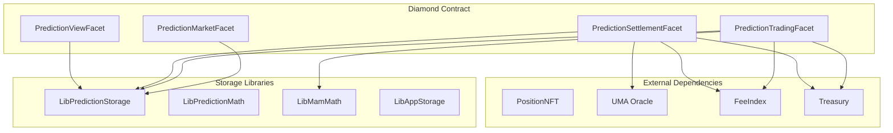
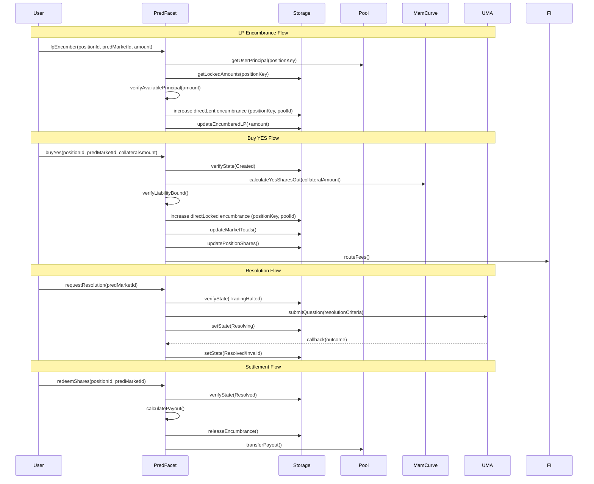
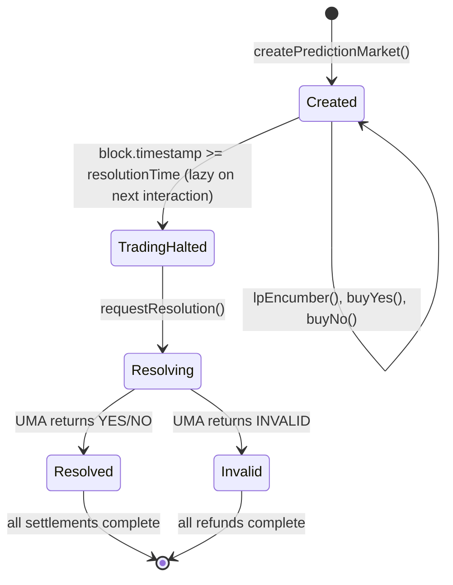

# Design Document: Isolated Prediction Markets

## Overview

Equalis Isolated Prediction Markets V1 introduces permissionless binary outcome markets as an isolated spoke that draws capacity from Equalis single-asset pools without exposing passive depositors to prediction market risk. The system leverages the existing Position NFT infrastructure, pool system, and encumbrance mechanisms to create isolated prediction markets where LPs explicitly underwrite outcome payouts.

The prediction market is fundamentally a temporary settlement domain: it sells outcome claims via MAM curves, settles once via UMA's optimistic oracle, then closes forever. No rolling risk, no rehypothecation, no contagion to passive depositors.

Key design principles:
- **Isolation by encumbrance**: LP capital uses `LibEncumbrance.position(positionKey, poolId).directLent` and trader stakes use `LibEncumbrance.position(positionKey, poolId).directLocked`
- **MAM curve pricing**: YES and NO outcomes priced via time-weighted curves with shared liability cap
- **UMA oracle resolution**: Optimistic oracle with dispute mechanism for fair outcome determination
- **Stablecoin settlement**: V1 requires collateral pool to be a stablecoin for direct USD accounting
- **No early redemption**: LPs and traders cannot redeem before settlement; Position NFTs can be transferred and partially split

## Architecture

### High-Level Architecture



### Component Interaction Flow



### Market State Machine



## Components and Interfaces

### PredictionMarketFacet

Handles market creation and LP operations.

```solidity
interface IPredictionMarketFacet {
    function createPredictionMarket(PredictionMarketParams calldata params) external returns (uint256 predMarketId);
    function lpEncumber(uint256 positionId, uint256 predMarketId, uint256 amount) external;
    function setOracleAllowlist(address oracleAdapter, bool allowed) external;
    function setOracleAdapter(address oracleAdapter) external;
    function setMarketBounds(PredictionMarketBounds calldata bounds) external;
}

V1 uses a single global UMA adapter set via `setOracleAdapter`; markets do not select an adapter per-market.

struct PredictionMarketParams {
    uint256 collateralPoolId;
    string question;
    bytes resolutionCriteria;
    uint64 resolutionTime;
    uint32 disputeWindow;
    PredictionFeeConfig feeConfig;
    MamCurveConfig mamConfigYES;
    MamCurveConfig mamConfigNO;
    uint256 maxNotionalCap;
}

struct MamCurveConfig {
    uint128 startPrice;      // e.g., 0.40e18 (40%)
    uint128 endPrice;        // e.g., 0.95e18 (95%)
    uint128 maxVolume;       // max shares sellable
}

struct PredictionFeeConfig {
    uint16 tradingFeeBps;
    uint16 resolutionFeeBps; // applied to max(totalYesShares, totalNoShares)
    uint16 feeIndexSplitBps;
    uint16 lpSplitBps;
}

// Treasury share is applied first using the global split; the remaining fee amount is split by feeIndexSplitBps/lpSplitBps.
```

### PredictionTradingFacet

Handles trader operations for buying outcome claims.

```solidity
interface IPredictionTradingFacet {
    function buyYes(uint256 positionId, uint256 predMarketId, uint256 collateralAmount) external returns (uint256 sharesOut);
    function buyNo(uint256 positionId, uint256 predMarketId, uint256 collateralAmount) external returns (uint256 sharesOut);
}
```

### PredictionSettlementFacet

Handles resolution and settlement operations.

```solidity
interface IPredictionSettlementFacet {
    function requestResolution(uint256 predMarketId) external;
    function settleResolution(uint256 predMarketId, PredictionOutcome outcome) external;
    function redeemShares(uint256 positionId, uint256 predMarketId) external returns (uint256 payout);
    function refundTrader(uint256 positionId, uint256 predMarketId) external returns (uint256 refund);
    function settleLp(uint256 positionId, uint256 predMarketId) external returns (uint256 returned);
}

enum PredictionOutcome {
    Pending,
    Yes,
    No,
    Invalid
}
```

### PredictionViewFacet

Read-only functions for querying state.

```solidity
interface IPredictionViewFacet {
    function getPredictionMarket(uint256 predMarketId) external view returns (PredictionMarket memory);
    function getPosition(uint256 predMarketId, uint256 positionId) external view returns (PredictionPosition memory);
    function getYesPrice(uint256 predMarketId) external view returns (uint256 price);
    function getNoPrice(uint256 predMarketId) external view returns (uint256 price);
    function getMarketTotals(uint256 predMarketId) external view returns (MarketTotals memory);
    function getLiabilityBound(uint256 predMarketId) external view returns (uint256 maxPayout, uint256 availableCapacity);
    function previewBuyYes(uint256 predMarketId, uint256 collateralAmount) external view returns (uint256 sharesOut, uint256 price);
    function previewBuyNo(uint256 predMarketId, uint256 collateralAmount) external view returns (uint256 sharesOut, uint256 price);
    function getMarketState(uint256 predMarketId) external view returns (PredictionState);
}
```

### UMA Oracle Adapter Interface

```solidity
interface IUmaOracleAdapter {
    function submitQuestion(bytes calldata resolutionCriteria, uint256 bondAmount) external returns (bytes32 questionId);
    function getOutcome(bytes32 questionId) external view returns (PredictionOutcome outcome, bool finalized);
    function isAllowlisted() external view returns (bool);
}
```

## Data Models

Position NFTs are transferable and support partial splits. A split moves proportional YES/NO shares, cost basis, and trader stake to the new NFT while keeping encumbrance locked in the market.

### Storage Structures

```solidity
library PredictionTypes {
    enum PredictionState {
        Created,
        TradingHalted,
        Resolving,
        Resolved,
        Invalid
    }
    
    struct PredictionMarket {
        // Immutable parameters
        uint256 collateralPoolId;
        string question;
        bytes resolutionCriteria;
        uint64 resolutionTime;
        uint32 disputeWindow;
        PredictionFeeConfig feeConfig;
        MamCurveConfig mamConfigYES;
        MamCurveConfig mamConfigNO;
        uint256 maxNotionalCap;
        address oracleAdapter; // global adapter used for V1
        
        // Market state
        PredictionState state;
        PredictionOutcome outcome;
        bytes32 umaQuestionId;
        
        // Totals
        uint256 totalYesShares;
        uint256 totalNoShares;
        uint256 traderPremiums;
        uint256 lpFeesAccrued;
        uint256 encumberedLP;
        
        // Curve state
        uint128 yesRemainingVolume;
        uint128 noRemainingVolume;
        
        bool active;
    }
    
    struct PredictionPosition {
        uint256 yesShares;
        uint256 noShares;
        uint256 costBasis;
        uint256 stake;
        bool redeemed;
    }
    
    struct MarketTotals {
        uint256 totalYesShares;
        uint256 totalNoShares;
        uint256 traderPremiums;
        uint256 lpFeesAccrued;
        uint256 encumberedLP;
    }
}
```

Fee index share accrues directly to the pool fee index and is not stored in market totals; liability checks use `lpFeesAccrued + feeIndexShareAccrued + treasuryShareTransferred`.

### Storage Layout

```solidity
library LibPredictionStorage {
    bytes32 internal constant STORAGE_POSITION = keccak256("equalis.prediction.storage");
    
    struct PredictionStorage {
        // Configuration
        mapping(address => bool) allowedOracles;
        PredictionMarketBounds bounds;
        
        // Markets
        uint256 nextPredMarketId;
        mapping(uint256 => PredictionTypes.PredictionMarket) markets;
        
        // Positions: predMarketId => positionKey => PredictionPosition
        mapping(uint256 => mapping(bytes32 => PredictionTypes.PredictionPosition)) positions;
        
        // Encumbrance is tracked in LibEncumbrance (directLent/directLocked) by positionKey + poolId
        
        // Tracking lists
        LibPositionList.List lpsByMarket;
        LibPositionList.List tradersByMarket;
    }
    
    struct PredictionMarketBounds {
        uint32 minDisputeWindow;
        uint32 maxDisputeWindow;
        uint16 maxTradingFeeBps;
        uint16 maxResolutionFeeBps;
        uint256 minResolutionTimeBuffer;  // min time from now to resolutionTime
    }
    
    function s() internal pure returns (PredictionStorage storage ps) {
        bytes32 position = STORAGE_POSITION;
        assembly {
            ps.slot := position
        }
    }
}
```

### Available Principal Calculation

```solidity
library LibPredictionHelpers {
    /// @notice Calculate available principal for a position in a pool
    /// @dev Available = userPrincipal - all encumbered amounts
    function getAvailablePrincipal(
        bytes32 positionKey,
        uint256 poolId
    ) internal view returns (uint256 available) {
        Types.PoolData storage pool = LibAppStorage.s().pools[poolId];
        uint256 userPrincipal = pool.userPrincipal[positionKey];
        uint256 totalLocked = LibEncumbrance.total(positionKey, poolId);
        available = userPrincipal > totalLocked ? userPrincipal - totalLocked : 0;
    }
}
```

### Liability Bound Calculation

```solidity
library LibPredictionMath {
    uint256 internal constant PRICE_SCALE = 1e18;
    uint256 internal constant BPS_SCALE = 10000;
    
    /// @notice Calculate max payout (worst case liability)
    /// @param totalYesShares Total YES shares sold
    /// @param totalNoShares Total NO shares sold
    /// @return maxPayout The maximum payout if either side wins
    function calculateMaxPayout(
        uint256 totalYesShares,
        uint256 totalNoShares
    ) internal pure returns (uint256 maxPayout) {
        // Shares redeem at 1.0, so max payout is max of either side
        maxPayout = totalYesShares > totalNoShares ? totalYesShares : totalNoShares;
    }
    
    /// @notice Calculate available capacity for new trades
    /// @param encumberedLP LP capital locked for this market
    /// @param traderPremiums Total collateral paid by traders
    /// @param totalFeesRemoved Total fees removed from payout backing (Treasury share + LP share + fee index share)
    /// @param maxPayout Current max payout
    /// @return capacity Remaining capacity for new share sales
    function calculateCapacity(
        uint256 encumberedLP,
        uint256 traderPremiums,
        uint256 totalFeesRemoved,
        uint256 maxPayout
    ) internal pure returns (uint256 capacity) {
        uint256 totalFunds = encumberedLP + traderPremiums;
        uint256 available = totalFunds > totalFeesRemoved ? totalFunds - totalFeesRemoved : 0;
        capacity = available > maxPayout ? available - maxPayout : 0;
    }
    
    /// @notice Verify liability bound is satisfied
    /// @return valid True if maxPayout <= encumberedLP + traderPremiums - totalFeesRemoved
    function verifyLiabilityBound(
        uint256 encumberedLP,
        uint256 traderPremiums,
        uint256 totalFeesRemoved,
        uint256 maxPayout
    ) internal pure returns (bool valid) {
        uint256 totalFunds = encumberedLP + traderPremiums;
        uint256 available = totalFunds > totalFeesRemoved ? totalFunds - totalFeesRemoved : 0;
        valid = maxPayout <= available;
    }
}
```

### MAM Curve Price Calculation

```solidity
library LibPredictionCurve {
    uint256 internal constant PRICE_SCALE = 1e18;
    
    /// @notice Calculate current price on the MAM curve
    /// @dev Uses linear interpolation between startPrice and endPrice based on time
    /// @param config The MAM curve configuration
    /// @param marketStartTime When the market was created
    /// @param resolutionTime When trading halts
    /// @return price Current price (scaled by 1e18)
    function calculatePrice(
        MamCurveConfig memory config,
        uint64 marketStartTime,
        uint64 resolutionTime
    ) internal view returns (uint256 price) {
        if (block.timestamp <= marketStartTime) {
            return config.startPrice;
        }
        if (block.timestamp >= resolutionTime) {
            return config.endPrice;
        }
        
        uint256 elapsed = block.timestamp - marketStartTime;
        uint256 duration = resolutionTime - marketStartTime;
        
        // Linear interpolation: price = startPrice + (endPrice - startPrice) * elapsed / duration
        if (config.endPrice >= config.startPrice) {
            uint256 delta = config.endPrice - config.startPrice;
            price = config.startPrice + (delta * elapsed / duration);
        } else {
            uint256 delta = config.startPrice - config.endPrice;
            price = config.startPrice - (delta * elapsed / duration);
        }
    }
    
    /// @notice Calculate shares out for a given collateral amount
    /// @param collateralAmount Amount of collateral being spent
    /// @param price Current price (scaled by 1e18)
    /// @return sharesOut Number of shares received
    function calculateSharesOut(
        uint256 collateralAmount,
        uint256 price
    ) internal pure returns (uint256 sharesOut) {
        require(price > 0, "Price cannot be zero");
        sharesOut = (collateralAmount * PRICE_SCALE) / price;
    }
}
```

## Correctness Properties

*A property is a characteristic or behavior that should hold true across all valid executions of a system—essentially, a formal statement about what the system should do. Properties serve as the bridge between human-readable specifications and machine-verifiable correctness guarantees.*

### Property 1: Market Parameter Round-Trip

*For any* valid market creation parameters, creating a market and then calling getPredictionMarket shall return the same immutable parameters that were provided at creation.

**Validates: Requirements 1.2, 1.8**

### Property 2: Market Creation Validation

*For any* market creation attempt with invalid parameters (non-stablecoin collateral pool, past resolution time, or out-of-bounds dispute window), the Prediction_Market_Factory shall revert with the appropriate error.

**Validates: Requirements 1.3, 1.4, 1.5**

### Property 3: Market Initialization State

*For any* newly created market, state shall be Created, and totalYesShares, totalNoShares, traderPremiums, lpFeesAccrued, and encumberedLP shall all be zero.

**Validates: Requirements 1.7**

### Property 4: LP Encumbrance State Consistency

*For any* valid LP encumbrance operation with positionId, predMarketId, and amountCollateral:
- LibEncumbrance.position(positionKey, poolId).directLent increases by exactly amountCollateral
- market.encumberedLP increases by exactly amountCollateral

**Validates: Requirements 2.2, 2.3**

### Property 5: Available Principal Calculation

*For any* position and pool, available principal shall equal userPrincipal minus LibEncumbrance.total(positionKey, poolId).

**Validates: Requirements 2.7**

### Property 6: LP Encumbrance Rejection

*For any* LP encumbrance attempt where amountCollateral exceeds available principal, the operation shall revert with InsufficientPrincipal error. *For any* encumbrance attempt after resolutionTime, the operation shall revert with TradingHalted error.

**Validates: Requirements 2.5, 2.6**

### Property 7: Trade State Consistency

*For any* valid buyYes or buyNo operation:
- LibEncumbrance.position(positionKey, poolId).directLocked increases by collateralAmount
- market.traderPremiums increases by (collateralAmount - tradingFee)
- market.totalYesShares or totalNoShares increases by sharesOut
- position.yesShares or noShares increases by sharesOut
- position.costBasis increases by collateralAmount

**Validates: Requirements 3.4, 3.5, 3.6, 3.7, 3.8, 4.4, 4.5, 4.6, 4.7, 4.8**

### Property 8: Liability Bound Enforcement

*For any* trade operation, the liability bound must be satisfied:
max(totalYesShares_after, totalNoShares_after) <= encumberedLP + traderPremiums_after - totalFeesRemoved

If this bound would be violated, the operation shall revert with LiabilityBoundExceeded error.

**Validates: Requirements 3.3, 3.12, 4.3, 4.12**

### Property 9: Trade Rejection Conditions

*For any* buyYes or buyNo attempt:
- If market state is not Created, shall revert with InvalidState error
- If block.timestamp >= resolutionTime, shall revert with TradingHalted error
- If trade would exceed maxNotionalCap, shall revert with NotionalCapExceeded error

**Validates: Requirements 3.1, 3.11, 3.13, 4.1, 4.11, 4.13**

### Property 10: Fee Routing Correctness

*For any* trade with tradingFee:
- treasuryAmount = tradingFee * treasuryShareBps / 10000 goes to Treasury
- remaining = tradingFee - treasuryAmount
- feeIndexAmount = remaining * feeIndexSplitBps / 10000 goes to FeeIndex
- lpAmount = remaining * lpSplitBps / 10000 goes to market.lpFeesAccrued
- feeIndexAmount + lpAmount == remaining

**Validates: Requirements 3.9, 4.9, 13.1, 13.2, 13.3, 13.4**

### Property 11: MAM Curve Price Calculation

*For any* market with startPrice, endPrice, marketStartTime, and resolutionTime:
- At marketStartTime, price == startPrice
- At resolutionTime, price == endPrice
- Price changes linearly between startPrice and endPrice over the duration
- sharesOut = collateralAmount / currentPrice

**Validates: Requirements 5.2, 5.3**

### Property 12: Shared Liability Cap

*For any* market, the sum of YES and NO share sales is bounded by the liability cap:
max(totalYesShares, totalNoShares) <= encumberedLP + traderPremiums - totalFeesRemoved

This cap is shared across both curves.

**Validates: Requirements 5.6**

### Property 13: State Transition Correctness

*For any* market:
- Created → TradingHalted: when block.timestamp >= resolutionTime
- TradingHalted → Resolving: when requestResolution() is called
- Resolving → Resolved: when UMA returns YES or NO
- Resolving → Invalid: when UMA returns INVALID

No other state transitions are valid.

**Validates: Requirements 6.2, 6.4, 6.5, 6.6, 7.4**

### Property 14: State-Based Action Restrictions

*For any* market:
- In Created state: lpEncumber, buyYes, buyNo are allowed
- In TradingHalted state: only requestResolution is allowed
- In Resolving state: no user actions allowed (waiting for oracle)
- In Resolved state: only redeemShares and settleLp are allowed
- In Invalid state: only refundTrader and settleLp are allowed

**Validates: Requirements 6.3, 7.1, 7.6**

### Property 15: Winner Payout Correctness

*For any* resolved market:
- If outcome is YES: yesShares redeem at 1.0, noShares redeem at 0.0
- If outcome is NO: noShares redeem at 1.0, yesShares redeem at 0.0
- payout = winningShares * 1.0 (full redemption value)

**Validates: Requirements 9.2, 9.7, 10.2, 10.7**

### Property 16: Settlement Encumbrance Release

*For any* settlement operation (redeemShares, refundTrader, settleLp):
- LibEncumbrance.position(positionKey, poolId).directLocked is released (set to zero)
- LibEncumbrance.position(positionKey, poolId).directLent is released (set to zero)
- position.yesShares and noShares are set to zero after redemption

**Validates: Requirements 9.4, 9.5, 10.4, 10.5, 11.3, 11.4, 12.3**

### Property 17: Invalid Refund Calculation

*For any* trader refund in Invalid state:
refund = costBasis - (costBasis * proportionalFeesAlreadyPaid / totalTraderPremiums)

The refund returns the trader's cost basis minus their proportional share of fees already paid.

**Validates: Requirements 11.2**

### Property 18: LP Settlement Calculation

*For any* LP settlement in Resolved state:
- If outcome is YES: lpReturn = encumberedLP - totalYesShares (LP pays winners)
- If outcome is NO: lpReturn = encumberedLP - totalNoShares (LP pays winners)
- lpReturn may be zero if all LP capital was used for payouts
- lpReturn includes LP's share of lpFeesAccrued

**Validates: Requirements 12.2**

### Property 19: Market Isolation

*For any* market, if LP capital is insufficient to cover payouts (should not happen with liability bound enforcement), the loss is isolated to that market only and does not affect:
- Other prediction markets
- Base pool withdrawals
- Other protocol products

**Validates: Requirements 12.6**

### Property 20: Principal Accounting Invariant

*For any* position and pool, after any operation (encumber, trade, settle, split):
- userPrincipal >= sum of all encumbered amounts for that position/pool
- No operation shall cause encumbered amounts to exceed userPrincipal
- trackedBalance in pool remains consistent with actual token balance

**Validates: Requirements 15.5**

## Error Handling

### Error Definitions

```solidity
// Market Creation Errors
error Pred_InvalidCollateralPool(uint256 poolId);
error Pred_InvalidResolutionTime(uint64 resolutionTime, uint64 currentTime);
error Pred_InvalidDisputeWindow(uint32 disputeWindow, uint32 minWindow, uint32 maxWindow);
error Pred_OracleNotAllowed(address oracleAdapter);
error Pred_MarketNotFound(uint256 predMarketId);

// LP Errors
error Pred_InsufficientPrincipal(uint256 requested, uint256 available);
error Pred_TradingHalted(uint256 predMarketId);

// Trading Errors
error Pred_InvalidState(PredictionState current, PredictionState required);
error Pred_LiabilityBoundExceeded(uint256 maxPayout, uint256 availableCapacity);
error Pred_NotionalCapExceeded(uint256 totalNotional, uint256 maxNotionalCap);
error Pred_VolumeExhausted(uint256 requested, uint256 remaining);
error Pred_ZeroAmount();

// Resolution Errors
error Pred_ResolutionNotReady(uint256 predMarketId, uint64 resolutionTime);
error Pred_AlreadyResolved(uint256 predMarketId);
error Pred_OracleNotFinalized(bytes32 questionId);

// Settlement Errors
error Pred_NotResolved(uint256 predMarketId);
error Pred_AlreadyRedeemed(uint256 predMarketId, uint256 positionId);
error Pred_NoSharesHeld(uint256 predMarketId, uint256 positionId);
error Pred_NoLpStake(uint256 predMarketId, uint256 positionId);

// Access Control Errors
error Pred_NotPositionOwner(uint256 positionId, address caller);
error Pred_NotGovernance(address caller);
```

### Error Handling Strategy

1. **Validation First**: All input validation occurs before state changes
2. **Atomic Operations**: Operations either complete fully or revert entirely
3. **Descriptive Errors**: Custom errors include relevant context for debugging
4. **State Checks**: All operations verify market state before proceeding
5. **Liability Safety**: Liability bound is checked before every trade

## Testing Strategy

### Unit Tests

Unit tests will cover:
- Market creation with valid and invalid parameters
- LP encumbrance edge cases (zero amounts, exact balance, insufficient principal)
- Buy YES/NO edge cases (minimum amounts, max leverage, capacity limits)
- MAM curve price calculations at various time points
- Liability bound calculations with various market states
- State transitions and action restrictions
- Settlement calculations for YES wins, NO wins, and Invalid
- Fee routing calculations

### Property-Based Tests

Property-based tests will use Foundry's fuzzing capabilities to verify:
- Market parameter round-trip correctness
- Liability bound enforcement across random trades
- Fee routing correctness (splits sum to total)
- MAM curve price monotonicity
- Settlement payout correctness
- Principal accounting invariant preservation

Each property test will:
- Run minimum 100 iterations
- Use constrained random inputs within valid ranges
- Reference the specific design property being tested
- Tag format: **Feature: isolated-prediction-markets, Property {number}: {property_text}**

### Integration Tests

Integration tests will cover:
- Full market lifecycle (create → trade → resolve → settle)
- Multi-trader scenarios with YES and NO positions
- LP economics (encumber → earn fees → settle)
- Invalid resolution and refund flow
- Position split with prediction market exposures
- Multi-market isolation verification

### Test Framework

- **Framework**: Foundry (forge test)
- **Property Testing**: Foundry's built-in fuzzing
- **Coverage Target**: 90%+ line coverage for core logic
- **Gas Benchmarks**: Track gas costs for all user-facing operations
- **UMA Mocking**: Mock UMA oracle for deterministic testing
